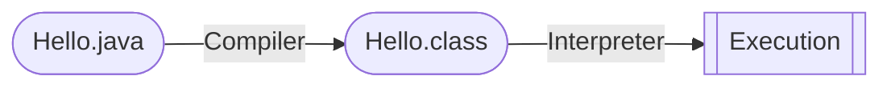

# CS61B-sp21 Lecture Notes

Notes taken when auditing CS 61B, please refer to the original slides and lecture videos on [course homepage](https://sp21.datastructur.es) created by Josh and lovely CS 61B Staff team.

<details>
  <summary><b>Table of Contents</b></summary>

- [Week 1](#week-1)
  - [Lecture 1: Hello World Java](#lecture-1-hello-world-java)
  - [Lecture 2: Defining and Using Classes](#lecture-2-defining-and-using-classes)
    - [Compilation](#compilation)
    - [Defining and Instantiating Classes](#defining-and-instantiating-classes)
    - [Static vs. Instance Members](#static-vs-instance-members)
    - [Managing Complexity with Helper Methods](#managing-complexity-with-helper-methods)
- [Week 2](#week-2)
  - [Lecture 3: Testing](#lecture-3-testing)
  - [Lecture 4: References, Recursion, and Lists](#lecture-4-references-recursion-and-lists)
    - [Primitive Types](#primitive-types)
    - [Reference Types](#reference-types)
    - [Parameter Passing](#parameter-passing)
    - [Instantiating Arrays](#instantiating-arrays)
    - [IntList and Linked Data Structures](#intlist-and-linked-data-structures)
  - [Lecture 5: SLLists, Nested Classes, and Sentinel Nodes](#lecture-5-sllists-nested-classes-and-sentinel-nodes)
    - [Access Control](#access-control)
    - [Nested Classes](#nested-classes)
    - [Invariants](#invariants)
- [Week 3](#week-3)
  - [Lecture 6: DLLists and Arrays](#lecture-6-dllists-and-arrays)
    - [Doubly Linked Lists](#doubly-linked-lists)
    - [Generic Lists](#generic-lists)
    - [Arrays](#arrays)
    - [Arrays vs. Classes](#arrays-vs-classes)
  - [Lecture 7: ALists, Resizing, and vs. SLLists](#lecture-7-alists-resizing-and-vs-sllists)
    - [Naive Array Lists](#naive-array-lists)
    - [Resizing Array](#resizing-array)
    - [Generic ALists](#generic-alists)
  - [Lecture 8: Inheritance and Implementation](#lecture-8-inheritance-and-implementation)
    - [Overriding vs. Overloading](#overriding-vs-overloading)
    - [Interface Inheritance](#interface-inheritance)
    - [Implementation Inheritance](#implementation-inheritance)
    - [Static and Dynamic Type, Dynamic Type Selection](#static-and-dynamic-type-dynamic-type-selection)
- [Week 4](#week-4)
  - [Lecture 9: Extends, Casting, and Higher Order Functions](#lecture-9-extends-casting-and-higher-order-functions)
    - [Implementation Inheritance - Extends](#implementation-inheritance---extends)
    - [Encapsulation](#encapsulation)
    - [Type Checking and Casting](#type-checking-and-casting)
    - [Higher Order Functions](#higher-order-functions)
  - [Lecture 10: Subtype Polymorphism vs. HoFs](#lecture-10-subtype-polymorphism-vs-hofs)
    - [Subtype Polymorphism](#subtype-polymorphism)
  - [Lecture 11: Exceptions, Iterators, and Object Methods](#lecture-11-exceptions-iterators-and-object-methods)
    - [Lists and Sets in Java](#lists-and-sets-in-java)
    - [Exceptions](#exceptions)
    - [Iteration](#iteration)
    - [`toString()` and Equals](#tostring-and-equals)
- [Week 5](#week-5)
  - [Lecture 12: Command Line Programming, Git, and Project 2 Preview](#lecture-12-command-line-programming-git-and-project-2-preview)
  - [Lecture 13: Asymptotics I](#lecture-13-asymptotics-i)
    - [Intuitive Runtime Characterizations](#intuitive-runtime-characterizations)
    - [Worst Case Order of Growth](#worst-case-order-of-growth)
    - [Big Theta](#big-theta)
    - [Big O Notation](#big-o-notation)

</details>

## Week 1

[`Lab1 Setup`](https://sp21.datastructur.es/materials/lab/lab1setup/lab1setup) [`Lab1`](https://sp21.datastructur.es/materials/lab/lab1/lab1) [`HW0`](https://sp21.datastructur.es/materials/hw/hw0/hw0)

### Lecture 1: Hello World Java

**Java is an object-oriented language with strict requirements:**
- Every file should contain a class declaration
- Codes live in classes
- Define main method using `public static void main(String[] args)`

**Java is strictly typed:**
- All variables, parameters, methods need type declaration
- Once declared, never change
- Expressions also have types
- ***Compiler checks type error before execution***

`javac` - **Compile**, `java` - **Run**

### Lecture 2: Defining and Using Classes

#### Compilation



Why `class` files?
- Type checked
- Simpler for machine to execute

#### Defining and Instantiating Classes

- Every method is associated with some classes
- Need a main method to run a class
- But not all classes have a main method

Defining a class *(a typical approach)*

`Instance variable`, `Constructor`, `Methods`

Instantiate an object
1. ***Declaration*** `Dog dog;`
2. ***Instantiation*** `new Dog();`
3. ***Assignment*** `dog = new Dog();`
4. ***Invocation*** `dog.makeNoise();`

Create array of objects
1. Use `new` to create an array `Dog[] dogs = new Dog[2];`
2. Use `new` again instantiate each object in the array `dogs[0] = new Dog();`

#### Static vs. Instance Members

> ***A class may have a mix of static and non-static members.***

**Why static?** `x = Math.round(5.6);` -> some classes never need instantiation

Key differences
- Static methods are invoked using class names `Dog.makeNoise();`
- Instance methods are invoked using instance names `smallDog.makeNoise();`
- Static method cannot access "myself" instance variable because there is no `this`

#### Managing Complexity with Helper Methods

Why those classes and static methods?
- Fewer choices for programmers
- Fewer ways to do things
- ***Less Complexity***

Helper Methods
- Decompose large problems into small ones
- Make fewer mistakes by focusing on one single task
- Easier to debug

## Week 2

[`Lab2 Setup`](https://sp21.datastructur.es/materials/lab/lab2setup/lab2setup) [`Lab2`](https://sp21.datastructur.es/materials/lab/lab2/lab2)

### Lecture 3: Testing

***Ad-Hoc Testing* is tedious**
```java
for (int i = 0; i < input.length; i += 1) {
    if (!input[i].equals(expected[i])) {
        System.out.println("Mismatch at position " + i + ", expected: '" + expected[i] + 
                "', but got '" + input[i] + "'");
        return;
    }
}
```

***JUnit* is a library for making testing easier**
```java
org.junit.Assert.assertArrayEquals(expected, input);
```

1. `org.junit.Assert.assertEquals(expected, actual)`, and there are lots more ***asserts***
2. Annotate each test with `@org.junit.Test`
    - Change all tests to `non-static`
    - OK to delete `main`
3. To eliminate redundancy, `import org.junit.Test;` and `import static org.junit.Assert.*;`

Tests provide **stability** and **scaffolding**
- Provide confidence in basic units and mitigate possibility of breaking them
- Help focus on one task at a time
- In larger projects, safer to ***refactor*** (redesign and rewrite)

### Lecture 4: References, Recursion, and Lists

#### Primitive Types

Each Java type has a different way to interpret the bits. 8 primitive types in Java: `byte`, `short`, `int`, `long`, `float`, `double`, `boolean`, `char`.

When declaring a variable of certain type:
- Computer ***sets aside exactly enough bits to hold*** a thing of that type
- Java create an internal table that maps each each variable name to a location
- Java does NOT write anything into the reversed boxes

> ***Golden Rule of Equals***: `y = x` copies all the bits from `x` into `y`

#### Reference Types

Everything *other than the 8 primitive types*, including arrays, **is a reference type**.

When we instantiate an `Object`:
- Java first allocates a box of bits for each instance variable of the class and fills them with a **default value** (0 -> `null`)
- The constructor then usually fills every such box with some other value

When declaring a `variable` ***of any reference type***:
- Java allocates exactly a box of size 64 bits, no matter what type of object.
- These bits can be either set to `null` or the 64-bit address of a specific instance of that class (returned by `new`)

> ***Reference types obey the Golden Rule of Equals!*** **copies the bits** which is actually the address.

#### Parameter Passing

> ***Passing parameters also obeys the same rule***, simply **copies the bits** to the new scope.

Summary of the Golden Rule:
- `Pass by value`: 8 primitive types
- `Pass by reference`: References to `Objects` *(address)*, reference may be `null`

#### Instantiating Arrays

- **Declaration** `int[] a;`
  - Declaration creates a 64-bit box intended only for storing **a reference to the array**, *NO Object is instantiated*.
- **Instantiation** `new int[]{1, 2, 3, 4, 5};`
  - Instantiates a new Object, in this case is an int array.
  - Objects are anonymous!
- **Assignment** `int[] a = new int[]{1, 2, 3, 4, 5};`
  - Puts the address of this new object into the box named `a`.
  - ***Instantiated Objects can be lost***: If `a` is reassigned to something else, NEVER able to get the original Object back!

#### IntList and Linked Data Structures

- ***Recursion***
- ***Iteration***

### Lecture 5: SLLists, Nested Classes, and Sentinel Nodes

#### Access Control

Use `private` keyword to prevent code ***in other classes*** from using members (or constructors) of a class.

Hide implementation details from users of your class
- Less for user of class to understand
- Safe for you to change private methods (implementation)

#### Nested Classes

Nested Classes are useful when a class doesn't stand on its own and is obviously subordinate to another class.
- Make the nested class `private` if the other class should NEVER use it.
- Declare the nested class `static` if it NEVER uses the instance variables or methods of the outer class.

#### Invariants

An **invariant** is a ***condition that is guaranteed to be true*** during code execution.

An `SLList` with a `sentinel` node has at least the following invariants:
- The `sentinel` reference always points to a `sentinel` node.
- The first node (if exists), is always at `sentinel.next`.
- The `size` variable is always the total number of items that have been added.

Invariants make it easier to reason about code
- Can assume they are true to simplify code
- Must ensure that methods preserve invariants

## Week 3

[`Lab 3`](https://sp21.datastructur.es/materials/lab/lab3/lab3)

### Lecture 6: DLLists and Arrays

`SLList` Singly Linked List; `DLList` Doubly Linked List

#### Doubly Linked Lists

- **Naive:** `last` sometimes points at `sentinel`, and sometimes points at an actual node
- **Double sentinel:** have two sentinels `sentFront` and `sentBack`
- **Circular sentinel:** `last.next = sentinel`

#### Generic Lists

Java allows us to **defer type selection** *until declaration*:
```java
public class DLList<Type> {
    ...
    public class IntNode {
        public Type item;
        ...
    }
    ...
}
```

- In the `.java` file implementing data structure, specify the "generic type" only once at the top
- In the `.java` files using data structure, specify type once
  - Write out desire type during declaration `DLList<String> s1;`
  - Use empty diamond operator `<>` during instantiation `s1 = new DLList<>("hello");`
- When declaring or instantiating data structure, use ***reference type***:
  - int: `Integer`
  - double: `Double`
  - long: `Long`
  - char: `Character`
  - boolean: `Boolean`

#### Arrays

`Arrays` are a special kind of object which consists of a ***numbered sequence*** of memory boxes.

Arrays consist of:
- A fixed integer **length** (*cannot change!*)
- A sequence of `N` memory boxes where `N` = length such that
  - All of the boxes hold the **same type of value** and **same number of bits**
  - The boxes are numbered `0` through `N - 1`

Like instance of classes:
- Get one reference when it is created
- (almost) Always instantiated with `new`
- If you reassign all variables containing that reference, you can NEVER get it back

Three valid notations to create an array:
```java
y = new int[3]; // Creates an array containing three int boxes
x = new int[]{1, 2, 3, 4, 5};
int[] w = {8, 9, 10} // Can omit new if also declaring variable
```

Copying an array
- Item by item using a loop
- Using `System.arraycopy`, it takes five parameters:
  - **Source** array
  - Starting position in **source**
  - **Target** array
  - Starting position in **target**
  - Number to copy

2D Arrays
- **Arrays of** *array addresses*
- Array boxes can contain references to arrays

#### Arrays vs. Classes

Arrays and Classes can both be used to organize a bunch of ***memory boxes***

|                     | Array Boxes           | Class Boxes            |
| ------------------- | --------------------- | ---------------------- |
| **Access**          | `[]` notation         | `.` notation           |
| **Type of Boxes**   | MUST be the same type | may be different types |
| **Number of Boxes** | Fixed                 | Fixed                  |

- **Array indices** can be computed at runtime
- **Class member variable** names CANNOT be computed at runtime

### Lecture 7: ALists, Resizing, and vs. SLLists

#### Naive Array Lists

`AList` Invariants:
- The position of the **next item to be inserted** is always `size`.
- The **last item** in the list is always in position `size - 1`.
- `size` is always the number of items in the AList.

#### Resizing Array

When the array get too full, just make a new array：
- Create a new array with size + 1
- `System.arraycopy(...)`
- Assign the address of the new array to the original array variable

Suppose we have a full array of size 100:
- If we call `addLast` two times, 203 memory boxes will be created and filled.
- If we call `addLast` until size is 1000, about 500,000 memory boxes needed.

**Resizing Slowness:** Inserting 100,000 items require roughly 5,000,000,000 new containers. ***Geometric resizing*** is much faster: `size + REFACTOR` -> `size * REFACTOR` (*how python list is implemented*)

**Memory efficiency:** An AList should not only be ***efficient in time***, but also ***efficient in space***
- Define the `usage ratio` `R = size / items.length`
- Half array size when R < 0.25 (*typical solution*)

#### Generic ALists

When creating an array of references to `Item`:
- `Item[] new Object[size];`
- Compile warning, ignore for now
- Just `new Item[size]` will cause a ***generic array creation*** error

Unlike integer based ALists, we need to **null out deleted items**
- Java only destroys unwanted object when the last reference has been lost.
- Keeping references to unneeded objects is called `loitering`.
- Save memory.
- Don't loiter.

### Lecture 8: Inheritance and Implementation

`SLList` and `AList` are both clearly some kind of "list":
1. Define a reference type for the hypernym (`List61B.java`)
   - use new keyword `interface` instead of `class`
   - `interface` is a specification of **what to do**, not how to do it
2. Specify that `SLList` and `AList` are hyponyms of that type
   - add new keyword `implements`
   - `implements` tells Java compiler that `SLList` and `AList` are hyponyms of `List61B`

#### Overriding vs. Overloading

`Overloading`: Java allows multiple methods with **the same name**, ***but different parameters***.
- Unnecessary long code, virtually identical, and aesthetically gross
- Won't work for future lists
- Hard to maintain

`Overriding`: If a subclass has a method with the **exact same signature** as in the superclass, ***we say the subclass overrides the method***.

Adding `@Override` notation
- Even without `@Override`, subclass still overrides the method
- Protect against typos
- Reminds programmer that method definition came from higher inheritance hierarchy

#### Interface Inheritance

> *The capabilities of a subclass using* `implements` *keyword is known as **interface inheritance**.*

- **Interface:** The list of all method signatures
  - *specifies what can do, but not how*
- **Inheritance:** The subclass inherits the interface from a superclass
  - *subclasses **MUST override all methods**, otherwise fail to compile*

(*Copying the bits*) If `X` is a superclass of `Y`, the memory boxes for `X` may contain `Y`
- An `AList` is also a list
- List variables can hold `AList` addresses

#### Implementation Inheritance

> *Subclass can also inherit **signatures** AND **implementation**.*

Use the `default` keyword to specify a method that subclasses should inherit from an interface
- `default void print() {...;}`
- Both `SLLList` and `AList` can use it

Overriding `default` methods
- Any call to `print()` on `SLList` will use this method instead of `default`
- Use `@Override` (*optional*) to catch typos like `public void pirnt()`

#### Static and Dynamic Type, Dynamic Type Selection

Variables in Java has a "**compile-time type**", a.k.a. `static type`
- This is the type specified at **declaration**
- ***NEVER changes!***

Variables also have a "**run-time type**", a.k.a. `dynamic type`
- This is the type specified at **instantiation**
- Equal to the type of the object being pointed at

`Dynamic Method Selection`
- compile-time type `X`
- run-time type `Y`
- if `Y` **overrides** the method, `Y`'s method is used instead
- ***[Rule 1]*** At compile time: use `static type` to determine the method **signature** `S`
- ***[Rule 2]*** At runtime: use `dynamic type` with the method of the **EXACT SAME signature** `S`

## Week 4

[`Lab4`](https://sp21.datastructur.es/materials/lab/lab4/lab4)

### Lecture 9: Extends, Casting, and Higher Order Functions

#### Implementation Inheritance - Extends

- When a class is a hyponym of an `interface`, we use `implements`
- When a class is a hyponym of ***another class***, we use `extends`

`Extends` inherits:
- All instance and static variables
- All methods
- All nested classes
- `private` members are not accessible

***Constructor** is not inherited*
- Explicitly call constructor with the `super` keyword `super();`
- Otherwise, Java will **automatically** do it with default constructor
- If you want to use a super constructor with parameter (*not the default one*), give parameters to `super(x);`

> `Extends` *should also be used with "**is-a**" relationship instead of "**has-a**"*

#### Encapsulation

Tools for managing complexity
- Hierarchical Abstraction
  - create **layers of abstraction**, with clear abstraction barriers
- "Design for change"
  - organize program around objects
  - let objects decide how things are done
  - **hide information** others do not need

> ***Implementation Inheritance Breaks Encapsulation***

#### Type Checking and Casting

An expression using the `new` keyword has the specific compile-time type:
- `SLList<Integer> sl = new VengefulSLList<Integer>();`
  - Compile-time type for the RHS expression is `VengefulSLList`
  - `VengefulSLList` ***is-an*** `SLList`, so the assignment is allowed
- `VengefulSLList<Integer> vsl = new SLList<Integer>();`
  - Compile-time type of the RHS expression is `SLList`
  - `SLList` is *not necessarily* a `VengefulSLList`, so compilation error results

Method calls have compile-time type equal to their declare type:
- `public static Dog maxDog(Dog d1, Dog d2) {...;}`
  - Any call to `maxDog` will have a compile-time `Dog`

Java have a special syntax for ***forcing the compile-time type of any expression***
- Put **desired type** in parenthesis *before the expression*
  - compile-time type `Dog`: `maxDog(d1, d2);`
  - compile-time type `Poodle`: `(Poodle) maxDog(d1, d2);`
- It is a way to trick the compiler
- A powerful but **dangerous** tool
  - Telling Java to treat an expression as having a different compile-time type
  - Effectively tells the compiler to ignore its type checking duties

#### Higher Order Functions

> ***A function that treats another functions as data***

In Java 7 or earlier
- Memory boxes cannot contain pointers to functions
- Can use `Interface` instead

```java
public interface IntUnaryFunction { int apply(int x); }

public class TenX implements IntUnaryFunction {
    public int apply(int x) { return 10 * x; }
}

public class HoFDemo {
    public static int do_twice(IntUnaryFunction f, int x) {
        return f.apply(f.apply(x));
    }

    public static void main(String[] args) {
        System.out.println(do_twice(new TenX(), 2));
    }
}
```

In Java 8
- Can hold references to methods

```java
public class Java8HoFDemo {
    public static int tenX(int x) { return 10 * x; }

    public static int doTwice(Function<Integer, Integer> f, int x) {
        return f.apply(f.apply(x));
    }

    public static void main(String[] args) {
        System.out.println(doTwice(Java8HoFDemo::tenX, 2));
    }
}
```

### Lecture 10: Subtype Polymorphism vs. HoFs

Recap of **Dynamic Methods Selection**:
- Compiler allows memory boxes to *hold any subtype*
- Compiler allows **calls based on static type**
- **Overridden non-static methods are selected at runtime based on dynamic type**
- Everything else is based on static type (*including overloaded methods*)

#### Subtype Polymorphism

> ***Polymorphism:** Providing a single interface to entities of different types.*

`Interface` provide us with ability to make ***callbacks***:
- Sometimes a function needs the help of another function that might not haven been written yet
- Some languages handle this using explicit function passing
- In Java, we do this by wrapping up the needed function in an `interface`
  - `Arrays.sort` needs `compare` that lives inside `Comparator` interface
  - `Arrays.sort` "*calls back*" whenever it needs a comparison

### Lecture 11: Exceptions, Iterators, and Object Methods

#### Lists and Sets in Java

Lists in real Java
- `List61B<Integer> L = new AList<>();`
- `java.util.List<Integer> L = new java.util.ArrayList<>();`

Sets in real Java
- `Set<String> S = new HashSet<>();`

#### Exceptions

> ***When something goes really wrong, break the normal flow of control.***

Explicit Exceptions
- Throw our own exceptions using the `throw` keyword
- Can provide informative message to a user
- Can provide more information to code that "catches" the exception

#### Iteration

Java allows us to iterate through `List` and `Set` using a convenient shorthand syntax sometimes called the "*foreach*" or "*enhanced for*" loop.

To support **ugly iteration**:
```java
Iterator<Integer> seer = javaset.iterator();
while (seer.hasNext()) {
    System.out.println(seer.next());
}
```
- Add an `iterator()` method to `ArraySet` that returns an `Iterator<T>`
- The `Iterator<T>` returned should have a useful `hasNext()` and `next()` method

To support the ***enhanced for* loop**:
```java
for (int x : javaset) {
    System.out.println(x);
}
```
- Complete the above support for ugly iteration
- Add `implements Iterable<T>` to the line defining the class

#### `toString()` and Equals

The `toString()` method provides a string representation of an object
- `System.out.println(Object x)` calls `x.toString()`
- The implementation of `toString()` in `Object`
  - name of the class
  - @ sign
  - memory location of the object

`.equals` vs. `==`
- `==` compares the bits. For references, `==` means *referencing the same object*
- `.equals` for classes, requiring overriding `.equals` for the class
  - default implementation of `.equals` uses `==` (*NOT what we want*)
  - use `Arrays.equals` or `Arrays.deepEquals` for arrays

## Week 5

### Lecture 12: Command Line Programming, Git, and Project 2 Preview

### Lecture 13: Asymptotics I

#### Intuitive Runtime Characterizations

```java
public static boolean dup1(int[] A) {  
    for (int i = 0; i < A.length; i += 1) {
        for (int j = i + 1; j < A.length; j += 1) {
            if (A[i] == A[j]) {
                return true;
            }
        }
    }
    return false;
}

public static boolean dup2(int[] A) {
    for (int i = 0; i < A.length - 1; i += 1) {
        if (A[i] == A[i + 1]) { 
            return true; 
        }
    }
    return false;
}
```

*Technique 1: Measure execution time in seconds using a client program*
- Good: Easy to measure, meaning is obvious.
- Bad: May require large amounts of computation time. Result varies with machine, compiler, input data, etc.

*Technique 2A: Count possible operations for an array of size N = 10000*
- Good: Machine independent. Input dependence captured in model.
- Bad: Tedious to compute. Array size was arbitrary. Doesn't tell you actual time.

*Technique 2B: Count possible operations in terms of input array size N*
- Good: Machine independent. Input dependence captured in model. Tells you how algorithm ***scales***.
- Bad: Tedious to compute. Array size was arbitrary. Doesn't tell you actual time.

**Comparing algorithms**

| Operation        | `dup1`            | `dup2`    |
| ---------------- | ----------------- | --------- |
| `i = 0`          | 1                 | 1         |
| `j = i + 1`      | 1 to N            |           |
| Less then `<`    | 2 to (N^2+3N+2)/2 | 0 to N    |
| Increment `+= 1` | 0 to (N^2+N)/2    | 0 to N-1  |
| Equals `==`      | 1 to (N^2-N)/2    | 1 to N-1  |
| Array Accesses   | 2 to N^2-N        | 2 to 2N-2 |

- Fewer operations to do the same work [e.g. 50,015,001 vs. 10000 operations]
- Better answer: Algorithm **scales better** *in the worst case* [(N^2+3N+2)/2 vs. N]
- Even better answer: **Parabolas (N^2) grow faster than lines (N)**

> *Algorithms which **scale well** (e.g. look like **lines**) have better asymptotic runtime behavior than algorithms that scale relatively poorly (e.g. look like **parabolas**).*

In most cases, we care only about `asymptotic behavior`, *i.e. what happens for very large N*.
- Simulation of billions of interacting particles
- Social network with billions of users
- Logging of billions of transactions
- Encoding of billions of bytes of video data

#### Worst Case Order of Growth

*Simplification 1: Consider only the worst case*
- Justification: When comparing algorithms, we often care only about the worst case.

*Simplification 2: Pick some representative operation to act as a proxy for the overall runtime*
- Good choice: **Increment** ((N^2+N)/2)
- Bad choice: `j = i + 1` (N)

*Simplification 3: Ignore lower order terms*
- (N^2+N)/2 -> (N^2)/2

*Simplification 4: Ignore multiplicative constants*
- (N^2)/2 -> N^2
- Why? It has no real meaning. We already threw away information when we choose a single proxy operation.

> *These simplifications are OK because we only care about the* `order of growth` *of the runtime.*

#### Big Theta

Suppose we have a function $R(N)$ with the order of growth of $f(N)$
- In `Big Theta` notation we write this as $R(N) \in \Theta (f(N))$
- $N^3 + 3N^4 \in \Theta (N^4)$
- $1/N + N^3 \in \Theta (N^3)$
- $1/N + 5 \in \Theta (1)$
- $Ne^N + N \in \Theta (Ne^N)$
- $40 \sin (N) + 4N^2 \in \Theta (N^2)$

#### Big O Notation

Whereas `Big Theta` can informally be thought of as something like "***equals***", `Big O` can be thought of as "***less than or equals***".
- $N^3 + 3N^4 \in \Theta (N^4)$
- $N^3 + 3N^4 \in O(N^4)$
- $N^3 + 3N^4 \in O(N^6)$
- $N^3 + 3N^4 \in O(N!)$
- $N^3 + 3N^4 \in O(N^{N!})$

Given a code snippet, we can express its runtime as a function $R(N)$, where $N$ is some property of the input of the function (often the size of the input). Rather than finding $R(N)$ exactly, we instead usually only care about the `order of growth` of $R(N)$. One approach:
- Choose a representative operation and let $C(N)$ be the count of how many times that operation occurs as a function of $N$
- Determine `order of growth` $f(N)$ of $C(N)$, i.e. $C(N) \in \Theta (f(N))$
  - *often (but not always) we consider the worst case count*
- If operation takes constant time, then $R(N) \in \Theta (f(N))$
- Can use $O$ as an alternative for $\Theta$, $O$ is used for **upper bounds**


