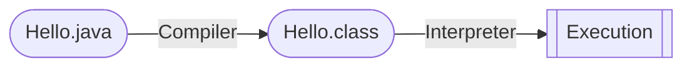
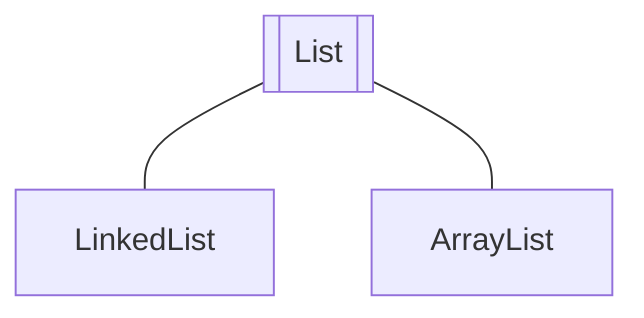
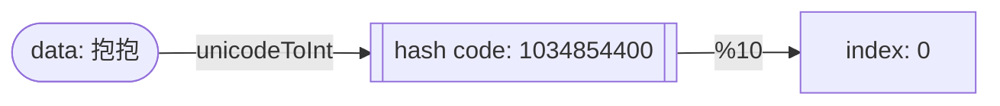
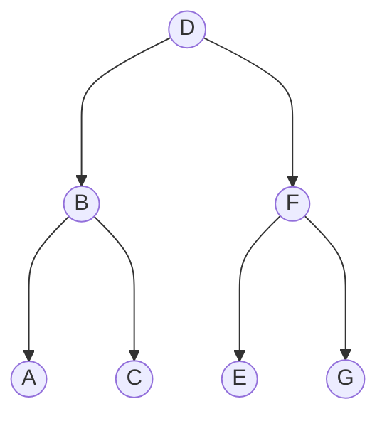
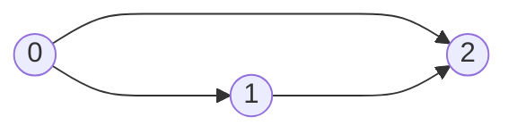

# CS61B-SP21 Lecture Notes

Notes taken when auditing CS 61B, please refer to the original slides and lecture videos on [course homepage](https://sp21.datastructur.es) created by Josh Hug and lovely CS 61B Staff team.

<details>
  <summary><b>Table of Contents</b></summary>

- [Week 1](#week-1)
  - [Lecture 1: Hello World Java](#lecture-1-hello-world-java)
  - [Lecture 2: Defining and Using Classes](#lecture-2-defining-and-using-classes)
    - [Compilation](#compilation)
    - [Defining and Instantiating Classes](#defining-and-instantiating-classes)
    - [Static vs. Instance Members](#static-vs-instance-members)
    - [Managing Complexity with Helper Methods](#managing-complexity-with-helper-methods)
- [Week 2](#week-2)
  - [Lecture 3: Testing](#lecture-3-testing)
  - [Lecture 4: References, Recursion, and Lists](#lecture-4-references-recursion-and-lists)
    - [Primitive Types](#primitive-types)
    - [Reference Types](#reference-types)
    - [Parameter Passing](#parameter-passing)
    - [Instantiating Arrays](#instantiating-arrays)
    - [IntList and Linked Data Structures](#intlist-and-linked-data-structures)
  - [Lecture 5: SLLists, Nested Classes, and Sentinel Nodes](#lecture-5-sllists-nested-classes-and-sentinel-nodes)
    - [Access Control](#access-control)
    - [Nested Classes](#nested-classes)
    - [Invariants](#invariants)
- [Week 3](#week-3)
  - [Lecture 6: DLLists and Arrays](#lecture-6-dllists-and-arrays)
    - [Doubly Linked Lists](#doubly-linked-lists)
    - [Generic Lists](#generic-lists)
    - [Arrays](#arrays)
    - [Arrays vs. Classes](#arrays-vs-classes)
  - [Lecture 7: ALists, Resizing, and vs. SLLists](#lecture-7-alists-resizing-and-vs-sllists)
    - [Naive Array Lists](#naive-array-lists)
    - [Resizing Array](#resizing-array)
    - [Generic ALists](#generic-alists)
  - [Lecture 8: Inheritance and Implementation](#lecture-8-inheritance-and-implementation)
    - [Overriding vs. Overloading](#overriding-vs-overloading)
    - [Interface Inheritance](#interface-inheritance)
    - [Implementation Inheritance](#implementation-inheritance)
    - [Static and Dynamic Type, Dynamic Type Selection](#static-and-dynamic-type-dynamic-type-selection)
- [Week 4](#week-4)
  - [Lecture 9: Extends, Casting, and Higher Order Functions](#lecture-9-extends-casting-and-higher-order-functions)
    - [Implementation Inheritance - Extends](#implementation-inheritance---extends)
    - [Encapsulation](#encapsulation)
    - [Type Checking and Casting](#type-checking-and-casting)
    - [Higher Order Functions](#higher-order-functions)
  - [Lecture 10: Subtype Polymorphism vs. HoFs](#lecture-10-subtype-polymorphism-vs-hofs)
    - [Subtype Polymorphism](#subtype-polymorphism)
  - [Lecture 11: Exceptions, Iterators, and Object Methods](#lecture-11-exceptions-iterators-and-object-methods)
    - [Lists and Sets in Java](#lists-and-sets-in-java)
    - [Exceptions](#exceptions)
    - [Iteration](#iteration)
    - [Object Methods: toString and Equals](#object-methods-tostring-and-equals)
- [Week 5](#week-5)
  - [Lecture 12: Command Line Programming, Git, and Project 2 Preview](#lecture-12-command-line-programming-git-and-project-2-preview)
  - [Lecture 13: Asymptotics I](#lecture-13-asymptotics-i)
    - [Intuitive Runtime Characterizations](#intuitive-runtime-characterizations)
    - [Worst Case Order of Growth](#worst-case-order-of-growth)
    - [Big Theta](#big-theta)
    - [Big O Notation](#big-o-notation)
- [Week 6](#week-6)
  - [Lecture 14: Disjoint Sets](#lecture-14-disjoint-sets)
    - [Quick Find](#quick-find)
    - [Quick Union](#quick-union)
    - [Weighted Quick Union](#weighted-quick-union)
    - [Path Compression](#path-compression)
  - [Lecture 15: Asymptotics II](#lecture-15-asymptotics-ii)
  - [Lecture 16: ADTs, Sets, Maps, and BSTs](#lecture-16-adts-sets-maps-and-bsts)
    - [Abstract Data Types](#abstract-data-types)
    - [BST Definitions](#bst-definitions)
    - [BST Operations](#bst-operations)
- [Week 7](#week-7)
  - [Lecture 17: B-Trees](#lecture-17-b-trees)
    - [BST Tree Height](#bst-tree-height)
    - [Height, Depth, and Performance](#height-depth-and-performance)
    - [B-Trees, 2-3 Trees, 2-3-4 Trees](#b-trees-2-3-trees-2-3-4-trees)
    - [B-Tree Invariants and runtime analysis](#b-tree-invariants-and-runtime-analysis)
  - [Lecture 18: Red Black Trees](#lecture-18-red-black-trees)
    - [BST Structure and Tree Rotation](#bst-structure-and-tree-rotation)
    - [Red Black Trees](#red-black-trees)
    - [Maintaining 1-1 Correspondence Through Rotations](#maintaining-1-1-correspondence-through-rotations)
    - [LLRB Runtime and Implementation](#llrb-runtime-and-implementation)
  - [Lecture 19: Hashing](#lecture-19-hashing)
    - [Data Indexed Arrays](#data-indexed-arrays)
    - [Integer Overflow and Hash Codes](#integer-overflow-and-hash-codes)
    - [Hash Table: Handling Collisions](#hash-table-handling-collisions)
    - [Hash Table Performance](#hash-table-performance)
    - [Hash Table in Java](#hash-table-in-java)
- [Week 8](#week-8)
  - [Lecture 20: Heaps and Priority Queues](#lecture-20-heaps-and-priority-queues)
    - [Heap](#heap)
    - [Tree Representations](#tree-representations)
  - [Lecture 21: Tree and Graph Traversals](#lecture-21-tree-and-graph-traversals)
    - [Tree Traversals](#tree-traversals)
    - [Graphs](#graphs)
    - [Graph Problems](#graph-problems)
    - [Depth-First Traversals](#depth-first-traversals)
  - [Lecture 22: Graph Traversals and Implementations](#lecture-22-graph-traversals-and-implementations)
    - [Graph API](#graph-api)
    - [Graph Representation and Runtime](#graph-representation-and-runtime)
    - [Graph Traversal Implementations and Runtime](#graph-traversal-implementations-and-runtime)
- [Week 9](#week-9)
  - [Lecture 23: Shortest Paths](#lecture-23-shortest-paths)
    - [DFS vs. BFS](#dfs-vs-bfs)
    - [Dijkstra's Algorithm](#dijkstras-algorithm)
    - [Dijkstra's Correctness and Runtime](#dijkstras-correctness-and-runtime)
    - [A\*](#a)
    - [A\* Heuristics](#a-heuristics)

</details>

## Week 1

[`Lab1 Setup`](https://sp21.datastructur.es/materials/lab/lab1setup/lab1setup) [`Lab1`](https://sp21.datastructur.es/materials/lab/lab1/lab1) [`HW0`](https://sp21.datastructur.es/materials/hw/hw0/hw0)

### Lecture 1: Hello World Java

**Java is an object-oriented language with strict requirements:**
- Every file should contain a class declaration
- Codes live in classes
- Define main method using `public static void main(String[] args)`

**Java is strictly typed:**
- All variables, parameters, methods need type declaration
- Once declared, never change
- Expressions also have types
- ***Compiler checks type error before execution***

`javac` - **Compile**, `java` - **Run**

### Lecture 2: Defining and Using Classes

#### Compilation



Why `class` files?
- Type checked
- Simpler for machine to execute

#### Defining and Instantiating Classes

- Every method is associated with some classes
- Need a main method to run a class
- But not all classes have a main method

Defining a class *(a typical approach)*

`Instance variable`, `Constructor`, `Methods`

Instantiate an object
1. ***Declaration*** `Dog dog;`
2. ***Instantiation*** `new Dog();`
3. ***Assignment*** `dog = new Dog();`
4. ***Invocation*** `dog.makeNoise();`

Create array of objects
1. Use `new` to create an array `Dog[] dogs = new Dog[2];`
2. Use `new` again instantiate each object in the array `dogs[0] = new Dog();`

#### Static vs. Instance Members

> ***A class may have a mix of static and non-static members.***

**Why static?** `x = Math.round(5.6);` -> some classes never need instantiation

Key differences
- Static methods are invoked using class names `Dog.makeNoise();`
- Instance methods are invoked using instance names `smallDog.makeNoise();`
- Static method cannot access "myself" instance variable because there is no `this`

#### Managing Complexity with Helper Methods

Why those classes and static methods?
- Fewer choices for programmers
- Fewer ways to do things
- ***Less Complexity***

Helper Methods
- Decompose large problems into small ones
- Make fewer mistakes by focusing on one single task
- Easier to debug

## Week 2

[`Lab2 Setup`](https://sp21.datastructur.es/materials/lab/lab2setup/lab2setup) [`Lab2`](https://sp21.datastructur.es/materials/lab/lab2/lab2)

### Lecture 3: Testing

***Ad-Hoc Testing* is tedious**
```java
for (int i = 0; i < input.length; i += 1) {
    if (!input[i].equals(expected[i])) {
        System.out.println("Mismatch at position " + i + ", expected: '" + expected[i] + 
                "', but got '" + input[i] + "'");
        return;
    }
}
```

***JUnit* is a library for making testing easier**
```java
org.junit.Assert.assertArrayEquals(expected, input);
```

1. `org.junit.Assert.assertEquals(expected, actual)`, and there are lots more ***asserts***
2. Annotate each test with `@org.junit.Test`
    - Change all tests to `non-static`
    - OK to delete `main`
3. To eliminate redundancy, `import org.junit.Test;` and `import static org.junit.Assert.*;`

Tests provide **stability** and **scaffolding**
- Provide confidence in basic units and mitigate possibility of breaking them
- Help focus on one task at a time
- In larger projects, safer to ***refactor*** (redesign and rewrite)

### Lecture 4: References, Recursion, and Lists

#### Primitive Types

Each Java type has a different way to interpret the bits. 8 primitive types in Java: `byte`, `short`, `int`, `long`, `float`, `double`, `boolean`, `char`.

When declaring a variable of certain type:
- Computer ***sets aside exactly enough bits to hold*** a thing of that type
- Java create an internal table that maps each each variable name to a location
- Java does NOT write anything into the reversed boxes

> ***Golden Rule of Equals***: `y = x` copies all the bits from `x` into `y`

#### Reference Types

Everything *other than the 8 primitive types*, including arrays, **is a reference type**.

When we instantiate an `Object`:
- Java first allocates a box of bits for each instance variable of the class and fills them with a **default value** (0 -> `null`)
- The constructor then usually fills every such box with some other value

When declaring a `variable` ***of any reference type***:
- Java allocates exactly a box of size 64 bits, no matter what type of object.
- These bits can be either set to `null` or the 64-bit address of a specific instance of that class (returned by `new`)

> ***Reference types obey the Golden Rule of Equals!*** **copies the bits** which is actually the address.

#### Parameter Passing

> ***Passing parameters also obeys the same rule***, simply **copies the bits** to the new scope.

Summary of the Golden Rule:
- `Pass by value`: 8 primitive types
- `Pass by reference`: References to `Objects` *(address)*, reference may be `null`

#### Instantiating Arrays

- **Declaration** `int[] a;`
  - Declaration creates a 64-bit box intended only for storing **a reference to the array**, *NO Object is instantiated*.
- **Instantiation** `new int[]{1, 2, 3, 4, 5};`
  - Instantiates a new Object, in this case is an int array.
  - Objects are anonymous!
- **Assignment** `int[] a = new int[]{1, 2, 3, 4, 5};`
  - Puts the address of this new object into the box named `a`.
  - ***Instantiated Objects can be lost***: If `a` is reassigned to something else, NEVER able to get the original Object back!

#### IntList and Linked Data Structures

- ***Recursion***
- ***Iteration***

### Lecture 5: SLLists, Nested Classes, and Sentinel Nodes

#### Access Control

Use `private` keyword to prevent code ***in other classes*** from using members (or constructors) of a class.

Hide implementation details from users of your class
- Less for user of class to understand
- Safe for you to change private methods (implementation)

#### Nested Classes

Nested Classes are useful when a class doesn't stand on its own and is obviously subordinate to another class.
- Make the nested class `private` if the other class should NEVER use it.
- Declare the nested class `static` if it NEVER uses the instance variables or methods of the outer class.

#### Invariants

An **invariant** is a ***condition that is guaranteed to be true*** during code execution.

An `SLList` with a `sentinel` node has at least the following invariants:
- The `sentinel` reference always points to a `sentinel` node.
- The first node (if exists), is always at `sentinel.next`.
- The `size` variable is always the total number of items that have been added.

Invariants make it easier to reason about code
- Can assume they are true to simplify code
- Must ensure that methods preserve invariants

## Week 3

[`Lab3`](https://sp21.datastructur.es/materials/lab/lab3/lab3)

### Lecture 6: DLLists and Arrays

`SLList` Singly Linked List; `DLList` Doubly Linked List

#### Doubly Linked Lists

- **Naive:** `last` sometimes points at `sentinel`, and sometimes points at an actual node
- **Double sentinel:** have two sentinels `sentFront` and `sentBack`
- **Circular sentinel:** `last.next = sentinel`

#### Generic Lists

Java allows us to **defer type selection** *until declaration*:
```java
public class DLList<Type> {
    ...
    public class IntNode {
        public Type item;
        ...
    }
    ...
}
```

- In the `.java` file implementing data structure, specify the "generic type" only once at the top
- In the `.java` files using data structure, specify type once
  - Write out desire type during declaration `DLList<String> s1;`
  - Use empty diamond operator `<>` during instantiation `s1 = new DLList<>("hello");`
- When declaring or instantiating data structure, use ***reference type***:
  - int: `Integer`
  - double: `Double`
  - long: `Long`
  - char: `Character`
  - boolean: `Boolean`

#### Arrays

`Arrays` are a special kind of object which consists of a ***numbered sequence*** of memory boxes.

Arrays consist of:
- A fixed integer **length** (*cannot change!*)
- A sequence of `N` memory boxes where `N` = length such that
  - All of the boxes hold the **same type of value** and **same number of bits**
  - The boxes are numbered `0` through `N - 1`

Like instance of classes:
- Get one reference when it is created
- (almost) Always instantiated with `new`
- If you reassign all variables containing that reference, you can NEVER get it back

Three valid notations to create an array:
```java
y = new int[3]; // Creates an array containing three int boxes
x = new int[]{1, 2, 3, 4, 5};
int[] w = {8, 9, 10} // Can omit new if also declaring variable
```

Copying an array
- Item by item using a loop
- Using `System.arraycopy`, it takes five parameters:
  - **Source** array
  - Starting position in **source**
  - **Target** array
  - Starting position in **target**
  - Number to copy

2D Arrays
- **Arrays of** *array addresses*
- Array boxes can contain references to arrays

#### Arrays vs. Classes

Arrays and Classes can both be used to organize a bunch of ***memory boxes***

|                     | Array Boxes           | Class Boxes            |
| ------------------- | --------------------- | ---------------------- |
| **Access**          | `[]` notation         | `.` notation           |
| **Type of Boxes**   | MUST be the same type | may be different types |
| **Number of Boxes** | Fixed                 | Fixed                  |

- **Array indices** can be computed at runtime
- **Class member variable** names CANNOT be computed at runtime

### Lecture 7: ALists, Resizing, and vs. SLLists

#### Naive Array Lists

`AList` Invariants:
- The position of the **next item to be inserted** is always `size`.
- The **last item** in the list is always in position `size - 1`.
- `size` is always the number of items in the AList.

#### Resizing Array

When the array get too full, just make a new array：
- Create a new array with size + 1
- `System.arraycopy(...)`
- Assign the address of the new array to the original array variable

Suppose we have a full array of size 100:
- If we call `addLast` two times, 203 memory boxes will be created and filled.
- If we call `addLast` until size is 1000, about 500,000 memory boxes needed.

**Resizing Slowness:** Inserting 100,000 items require roughly 5,000,000,000 new containers. ***Geometric resizing*** is much faster: `size + REFACTOR` -> `size * REFACTOR` (*how python list is implemented*)

**Memory efficiency:** An AList should not only be ***efficient in time***, but also ***efficient in space***
- Define the `usage ratio` `R = size / items.length`
- Half array size when R < 0.25 (*typical solution*)

#### Generic ALists

When creating an array of references to `Item`:
- `Item[] new Object[size];`
- Compile warning, ignore for now
- Just `new Item[size]` will cause a ***generic array creation*** error

Unlike integer based ALists, we need to **null out deleted items**
- Java only destroys unwanted object when the last reference has been lost.
- Keeping references to unneeded objects is called `loitering`.
- Save memory.
- Don't loiter.

### Lecture 8: Inheritance and Implementation

`SLList` and `AList` are both clearly some kind of "list":
1. Define a reference type for the hypernym (`List61B.java`)
   - use new keyword `interface` instead of `class`
   - `interface` is a specification of **what to do**, not how to do it
2. Specify that `SLList` and `AList` are hyponyms of that type
   - add new keyword `implements`
   - `implements` tells Java compiler that `SLList` and `AList` are hyponyms of `List61B`

#### Overriding vs. Overloading

`Overloading`: Java allows multiple methods with **the same name**, ***but different parameters***.
- Unnecessary long code, virtually identical, and aesthetically gross
- Won't work for future lists
- Hard to maintain

`Overriding`: If a subclass has a method with the **exact same signature** as in the superclass, ***we say the subclass overrides the method***.

Adding `@Override` notation
- Even without `@Override`, subclass still overrides the method
- Protect against typos
- Reminds programmer that method definition came from higher inheritance hierarchy

#### Interface Inheritance

> *The capabilities of a subclass using* `implements` *keyword is known as **interface inheritance**.*

- **Interface:** The list of all method signatures
  - *specifies what can do, but not how*
- **Inheritance:** The subclass inherits the interface from a superclass
  - *subclasses **MUST override all methods**, otherwise fail to compile*

(*Copying the bits*) If `X` is a superclass of `Y`, the memory boxes for `X` may contain `Y`
- An `AList` is also a list
- List variables can hold `AList` addresses

#### Implementation Inheritance

> *Subclass can also inherit **signatures** AND **implementation**.*

Use the `default` keyword to specify a method that subclasses should inherit from an interface
- `default void print() {...;}`
- Both `SLLList` and `AList` can use it

Overriding `default` methods
- Any call to `print()` on `SLList` will use this method instead of `default`
- Use `@Override` (*optional*) to catch typos like `public void pirnt()`

#### Static and Dynamic Type, Dynamic Type Selection

Variables in Java has a "**compile-time type**", a.k.a. `static type`
- This is the type specified at **declaration**
- ***NEVER changes!***

Variables also have a "**run-time type**", a.k.a. `dynamic type`
- This is the type specified at **instantiation**
- Equal to the type of the object being pointed at

`Dynamic Method Selection`
- compile-time type `X`
- run-time type `Y`
- if `Y` **overrides** the method, `Y`'s method is used instead
- ***[Rule 1]*** At compile time: use `static type` to determine the method **signature** `S`
- ***[Rule 2]*** At runtime: use `dynamic type` with the method of the **EXACT SAME signature** `S`

## Week 4

[`Lab4`](https://sp21.datastructur.es/materials/lab/lab4/lab4)

### Lecture 9: Extends, Casting, and Higher Order Functions

#### Implementation Inheritance - Extends

- When a class is a hyponym of an `interface`, we use `implements`
- When a class is a hyponym of ***another class***, we use `extends`

`Extends` inherits:
- All instance and static variables
- All methods
- All nested classes
- `private` members are not accessible

***Constructor** is not inherited*
- Explicitly call constructor with the `super` keyword `super();`
- Otherwise, Java will **automatically** do it with default constructor
- If you want to use a super constructor with parameter (*not the default one*), give parameters to `super(x);`

> `Extends` *should also be used with "**is-a**" relationship instead of "**has-a**"*

#### Encapsulation

Tools for managing complexity
- Hierarchical Abstraction
  - create **layers of abstraction**, with clear abstraction barriers
- "Design for change"
  - organize program around objects
  - let objects decide how things are done
  - **hide information** others do not need

> ***Implementation Inheritance Breaks Encapsulation***

#### Type Checking and Casting

An expression using the `new` keyword has the specific compile-time type:
- `SLList<Integer> sl = new VengefulSLList<Integer>();`
  - Compile-time type for the RHS expression is `VengefulSLList`
  - `VengefulSLList` ***is-an*** `SLList`, so the assignment is allowed
- `VengefulSLList<Integer> vsl = new SLList<Integer>();`
  - Compile-time type of the RHS expression is `SLList`
  - `SLList` is *not necessarily* a `VengefulSLList`, so compilation error results

Method calls have compile-time type equal to their declare type:
- `public static Dog maxDog(Dog d1, Dog d2) {...;}`
  - Any call to `maxDog` will have a compile-time `Dog`

Java have a special syntax for ***forcing the compile-time type of any expression***
- Put **desired type** in parenthesis *before the expression*
  - compile-time type `Dog`: `maxDog(d1, d2);`
  - compile-time type `Poodle`: `(Poodle) maxDog(d1, d2);`
- It is a way to trick the compiler
- A powerful but **dangerous** tool
  - Telling Java to treat an expression as having a different compile-time type
  - Effectively tells the compiler to ignore its type checking duties

#### Higher Order Functions

> ***A function that treats another functions as data***

In Java 7 or earlier
- Memory boxes cannot contain pointers to functions
- Can use `Interface` instead

```java
public interface IntUnaryFunction { int apply(int x); }

public class TenX implements IntUnaryFunction {
    public int apply(int x) { return 10 * x; }
}

public class HoFDemo {
    public static int do_twice(IntUnaryFunction f, int x) {
        return f.apply(f.apply(x));
    }

    public static void main(String[] args) {
        System.out.println(do_twice(new TenX(), 2));
    }
}
```

In Java 8
- Can hold references to methods

```java
public class Java8HoFDemo {
    public static int tenX(int x) { return 10 * x; }

    public static int doTwice(Function<Integer, Integer> f, int x) {
        return f.apply(f.apply(x));
    }

    public static void main(String[] args) {
        System.out.println(doTwice(Java8HoFDemo::tenX, 2));
    }
}
```

### Lecture 10: Subtype Polymorphism vs. HoFs

Recap of **Dynamic Methods Selection**:
- Compiler allows memory boxes to *hold any subtype*
- Compiler allows **calls based on static type**
- **Overridden non-static methods are selected at runtime based on dynamic type**
- Everything else is based on static type (*including overloaded methods*)

#### Subtype Polymorphism

> ***Polymorphism:** Providing a single interface to entities of different types.*

`Interface` provide us with ability to make ***callbacks***:
- Sometimes a function needs the help of another function that might not haven been written yet
- Some languages handle this using explicit function passing
- In Java, we do this by wrapping up the needed function in an `interface`
  - `Arrays.sort` needs `compare` that lives inside `Comparator` interface
  - `Arrays.sort` "*calls back*" whenever it needs a comparison

### Lecture 11: Exceptions, Iterators, and Object Methods

#### Lists and Sets in Java

Lists in real Java
- `List61B<Integer> L = new AList<>();`
- `java.util.List<Integer> L = new java.util.ArrayList<>();`

Sets in real Java
- `Set<String> S = new HashSet<>();`

#### Exceptions

> ***When something goes really wrong, break the normal flow of control.***

Explicit Exceptions
- Throw our own exceptions using the `throw` keyword
- Can provide informative message to a user
- Can provide more information to code that "catches" the exception

#### Iteration

Java allows us to iterate through `List` and `Set` using a convenient shorthand syntax sometimes called the "*foreach*" or "*enhanced for*" loop.

To support **ugly iteration**:
```java
Iterator<Integer> seer = javaset.iterator();
while (seer.hasNext()) {
    System.out.println(seer.next());
}
```
- Add an `iterator()` method to `ArraySet` that returns an `Iterator<T>`
- The `Iterator<T>` returned should have a useful `hasNext()` and `next()` method

To support the ***enhanced for* loop**:
```java
for (int x : javaset) {
    System.out.println(x);
}
```
- Complete the above support for ugly iteration
- Add `implements Iterable<T>` to the line defining the class

#### Object Methods: toString and Equals

The `toString()` method provides a string representation of an object
- `System.out.println(Object x)` calls `x.toString()`
- The implementation of `toString()` in `Object`
  - name of the class
  - @ sign
  - memory location of the object

`.equals` vs. `==`
- `==` compares the bits. For references, `==` means *referencing the same object*
- `.equals` for classes, requiring overriding `.equals` for the class
  - default implementation of `.equals` uses `==` (*NOT what we want*)
  - use `Arrays.equals` or `Arrays.deepEquals` for arrays

## Week 5

### Lecture 12: Command Line Programming, Git, and Project 2 Preview

Live lecture demo, see video [here](https://youtu.be/fvhqn5PeU_Q).

### Lecture 13: Asymptotics I

#### Intuitive Runtime Characterizations

```java
public static boolean dup1(int[] A) {  
    for (int i = 0; i < A.length; i += 1) {
        for (int j = i + 1; j < A.length; j += 1) {
            if (A[i] == A[j]) {
                return true;
            }
        }
    }
    return false;
}
```

```java
public static boolean dup2(int[] A) {
    for (int i = 0; i < A.length - 1; i += 1) {
        if (A[i] == A[i + 1]) { 
            return true; 
        }
    }
    return false;
}
```

*Technique 1: Measure execution time in seconds using a client program*
- Good: Easy to measure, meaning is obvious.
- Bad: May require large amounts of computation time. Result varies with machine, compiler, input data, etc.

*Technique 2A: Count possible operations for an array of size N = 10000*
- Good: Machine independent. Input dependence captured in model.
- Bad: Tedious to compute. Array size was arbitrary. Doesn't tell you actual time.

*Technique 2B: Count possible operations in terms of input array size N*
- Good: Machine independent. Input dependence captured in model. Tells you how algorithm ***scales***.
- Bad: Tedious to compute. Array size was arbitrary. Doesn't tell you actual time.

**Comparing algorithms**

| Operation        | `dup1`            | `dup2`    |
| ---------------- | ----------------- | --------- |
| `i = 0`          | 1                 | 1         |
| `j = i + 1`      | 1 to N            |           |
| Less then `<`    | 2 to (N^2+3N+2)/2 | 0 to N    |
| Increment `+= 1` | 0 to (N^2+N)/2    | 0 to N-1  |
| Equals `==`      | 1 to (N^2-N)/2    | 1 to N-1  |
| Array Accesses   | 2 to N^2-N        | 2 to 2N-2 |

- Fewer operations to do the same work [e.g. 50,015,001 vs. 10000 operations]
- Better answer: Algorithm **scales better** *in the worst case* [(N^2+3N+2)/2 vs. N]
- Even better answer: **Parabolas (N^2) grow faster than lines (N)**

> *Algorithms which **scale well** (e.g. look like **lines**) have better asymptotic runtime behavior than algorithms that scale relatively poorly (e.g. look like **parabolas**).*

In most cases, we care only about `asymptotic behavior`, *i.e. what happens for very large N*.
- Simulation of billions of interacting particles
- Social network with billions of users
- Logging of billions of transactions
- Encoding of billions of bytes of video data

#### Worst Case Order of Growth

*Simplification 1: Consider only the worst case*
- Justification: When comparing algorithms, we often care only about the worst case.

*Simplification 2: Pick some representative operation to act as a proxy for the overall runtime*
- Good choice: **Increment** ((N^2+N)/2)
- Bad choice: `j = i + 1` (N)

*Simplification 3: Ignore lower order terms*
- (N^2+N)/2 -> (N^2)/2

*Simplification 4: Ignore multiplicative constants*
- (N^2)/2 -> N^2
- Why? It has no real meaning. We already threw away information when we choose a single proxy operation.

> *These simplifications are OK because we only care about the* `order of growth` *of the runtime.*

#### Big Theta

Suppose we have a function $R(N)$ with the order of growth of $f(N)$
- In `Big Theta` notation we write this as $R(N) \in \Theta (f(N))$
- $N^3 + 3N^4 \in \Theta (N^4)$
- $1/N + N^3 \in \Theta (N^3)$
- $1/N + 5 \in \Theta (1)$
- $Ne^N + N \in \Theta (Ne^N)$
- $40 \sin (N) + 4N^2 \in \Theta (N^2)$

#### Big O Notation

Whereas `Big Theta` can informally be thought of as something like "***equals***", `Big O` can be thought of as "***less than or equals***".
- $N^3 + 3N^4 \in \Theta (N^4)$
- $N^3 + 3N^4 \in O(N^4)$
- $N^3 + 3N^4 \in O(N^6)$
- $N^3 + 3N^4 \in O(N!)$
- $N^3 + 3N^4 \in O(N^{N!})$

Given a code snippet, we can express its runtime as a function $R(N)$, where $N$ is some property of the input of the function (often the size of the input). Rather than finding $R(N)$ exactly, we instead usually only care about the `order of growth` of $R(N)$. One approach:
- Choose a representative operation and let $C(N)$ be the count of how many times that operation occurs as a function of $N$
- Determine `order of growth` $f(N)$ of $C(N)$, i.e. $C(N) \in \Theta (f(N))$
  - *often (but not always) we consider the worst case count*
- If operation takes constant time, then $R(N) \in \Theta (f(N))$
- Can use $O$ as an alternative for $\Theta$, $O$ is used for **upper bounds**

## Week 6

[`Lab6`](https://sp21.datastructur.es/materials/lab/lab6/lab6)

### Lecture 14: Disjoint Sets

**Disjoint Sets** data structure has two operations:
- `connect(x, y)` connects `x` and `y`.
- `isConnected(x, y)` returns true if `x` and `y` are connected. ***Connections can be transitive***.

Naive approach
- Connecting two things: Record every single connecting line in some data structure
- Checking connectedness: Do some sort of iteration over the lines to see if one thing can be reached from the other

Better approach
- Rather than manually writing out every single connecting line, **only record the sets that each item belong to**.
- `{0}, {1}, {2}, {3}, {4}, {5}, {6}`
  - `connect(0, 1) -> {0, 1}, {2}, {3}, {4}, {5}, {6}`
  - `connect(1, 2) -> {0, 1, 2}, {3}, {4}, {5}, {6}`
- For each item, its ***connected component*** is the set of all items that are connected to that item.

#### Quick Find

Data structure to support tracking of sets:
- Idea 1: **List of sets of integers**, `List<Set<Integer>>`
  - ***Complicated and slow***
  - Operations are linear when number of connections are small, have to iterate over all sets
- Idea 2: **List of integers** where `i`th entry gives set number (a.k.a. `id`) of item `i`
  - `connect(p, q)` changes entries that equal `id[p]` to `id(q)`
  - Very fast to `isConnected`, relatively slow to `connect`

#### Quick Union

Improving the connect operation - **Assign each item a parent** (instead of an id)
> *Results in a tree-like shape*

```
{0, 1, 2, 4}, {3, 5}, {6}

parent[-1, 0, 1, -1, 0, 3, -1]
        0  1  2   3  4  5   6
```

`connect(5, 2)` makes `root(5): 3` into a child of `root(2): 0`
- Performance issue: **Tree can get too tall!** `root(x)` becomes expensive

```
parent[-1, 0, 1, 0, 0, 3, -1]
        0  1  2  3  4  5   6
```

#### Weighted Quick Union

Modify Quick Union to avoid tall trees
- Track tree size (number of elements)
- ***Always link root of smaller trees to larger trees***

Performance summary

> *By tweaking Weighted Quick Union we have achieved **logarithmic time performance**.*

| Implementation      | Constructor  | `connect`    | `isConnected` |
| ------------------- | ------------ | ------------ | ------------- |
| List of Sets        | $\Theta (N)$ | $O(N)$       | $O(N)$        |
| Quick Find          | $\Theta (N)$ | $\Theta (N)$ | $\Theta (1)$  |
| Quick Union         | $\Theta (N)$ | $O(N)$       | $O(N)$        |
| Weighed Quick Union | $\Theta (N)$ | $O(\log N)$  | $O(\log N)$   |

#### Path Compression

Performing $M$ operations with $N$ elements:
- For our naive implementation, runtime is $O(MN)$
- For our best implementation, runtime is $O(N + M \log N)$
- For $N = M = 10^9$, difference is **30 years** vs. **6 seconds**

Clever idea: When we do `isConnected(15, 10)`, **tie all nodes seen to the root**. *(additional cost is insignificant, same order of growth)*
- Path compression results in a union/connected operations that are very very close to amortized constant time
- $M$ operations on $N$ nodes is $O(N + M \lg^* N)$
- $\lg^*$ is less than 5 for any realistic input

| $N$         | $\lg^* N$ |
| ----------- | --------- |
| $1$         | 0         |
| $2$         | 1         |
| $4$         | 2         |
| $16$        | 3         |
| $65536$     | 4         |
| $2^{65536}$ | 5         |

The ideas that made our implementation efficient:
- `ListOfSetsDS`: Store connected components as a list of sets *(slow, complicated)*
- `QuickFindDS`: Store connected components as set ids
- `QuickUnionDS`: Store connected components as **parent ids**
  - `WeightedQuickUnionDS`: Also track the size of each set, and **use size to decide on new tree root**
    - `WeightedQuickUnionWithPathCompressionDS`: On calls to connect and isConnected, ***set parent id to the root for all items seen***

### Lecture 15: Asymptotics II

Analysis of algorithms on `For Loops`, `Recurrence`, `Binary Search`, and `Merge Sort`.

Live examples, see video [here](https://www.youtube.com/playlist?list=PL8FaHk7qbOD5Ek10eT39UqAjcwr99xqZP).

### Lecture 16: ADTs, Sets, Maps, and BSTs

#### Abstract Data Types

> *An **Abstract Data Type** is defined only by its operations, not by its implementation.*



In Java, there is syntax differentiation between `ADT` and `Implementation` (`Interface` *in Java isn't purely abstract as they can obtain some implementation details, e.g.* `default` *methods*).

```java
List<Integer> L = new ArrayList<>(); // While List is abstract, ArrayList is concrete.
```

Among the most important interfaces in the `java.util` library are those that extend the `Collection` interface
- `List` Lists of things
- `Set` Sets of things
- `Map` Mappings between items

#### BST Definitions

A **tree** consists of
- A set of nodes
- A set of edges that connect those nodes
- *Constraint*: There is ***exactly one path*** between any two nodes.

> *A **Binary Search Tree** is a rooted binary tree with the* `BST` *property.*

For every node `X` in the tree:
- Every key in the **left** subtree is **less** than `X`'s key.
- Every key in the **right** subtree is **greater** than `X`'s key.

Ordering must be *complete*, *transitive*, and *antisymmetric*. Given keys $p$ and $q$:
- ***Exactly one*** of $p \prec q$ and $q \prec p$ is true
- $(p \prec q) \wedge (q \prec r) \implies p \prec r$
- *No duplicate keys are allowed!*

#### BST Operations

**BST Operation** `search`

If `searchKey` $\sim$ `T.key`, return
- If `searchKey` $\prec$ `T.key`, search `T.left`
- If `searchKey` $\succ$ `T.key`, search `T.right`

The runtime to complete a search on a "bushy" `BST` in the worst case is $\Theta (\log N)$ since the height of the tree is $\sim \log_2 N$, where $N$ is the number of nodes.
- It is really fast
- At $1$ microsecond per operation, it can find something from a tree of size $10^{300000}$ in one second

**BST Operation** `insert`

Search for key:
- If found, do nothing
- If not found
  - Create a new node
  - Set appropriate link

**BST Operation** `delete`

- Deletion key has no children
  - Sever the parent's link
  - Garbage collection
- Deletion key has one child
  - Move parent's pointer to the child
  - Garbage collection
- Deletion key has two children *(Hibbard Deletion)*
  - Find new node to replace it
  - Must be $\prec$ than everything in the **left** subtree
  - Must be $\succ$ than everything in the **right** subtree

## Week 7

[`Lab7`](https://sp21.datastructur.es/materials/lab/lab7/lab7) [`HW2`](https://sp21.datastructur.es/materials/hw/hw2/hw2.pdf)

### Lecture 17: B-Trees

#### BST Tree Height

|             | Bushy Tree                   | Spindly Tree                    |
| ----------- | ---------------------------- | ------------------------------- |
| Description | Two children each node leafy | One children each node linearly |
| Performance | $\Theta (\log N)$            | $\Theta (N)$                    |

BST height is all four of these:
- $\Theta (\log N)$ in the best case (bushy) - ***Informative***
- $\Theta (N)$ in the worst case (spindly) - ***Informative***
- $O(N)$
- $O(N^2)$

The usefulness of **Big O**
- Allows us to make simple blank statements
  - *Binary search is* $O(\log N)$
  - *Binary search is* $\Theta (\log N)$ *in the worst case*
- Sometime don't know the exact runtime, so use O to give an upper bound
- Easier to write proofs for Big O than Big Theta

#### Height, Depth, and Performance

- The `depth` **of a node** is how far it is from the root.
- The `height` **of a tree** is the depth of its deepest leaf.
  - *Determines the worst case runtime to find a node*
- The `average depth` of a tree is the average depth of a tree's nodes.
  - *Determines the average case runtime to find a node*

In real world applications we expect both insertion and deletion, random trees simulation including insertion and deletion show that they are still $\Theta (\log N)$ height! **Random trees are bushy**; however, we can't always insert out items in order - ***data comes in over time, we don't have them in advance***.

#### B-Trees, 2-3 Trees, 2-3-4 Trees

Avoid new leaves by *overstuffing* the leaf nodes
- Adding new leaves at the bottom
- Overstuffed trees always have balanced height, because leaf depths never change
- Height is just `max(depth)`

Height is balanced, but leaf nodes can get juicy
- Set limit $L$ on the number of items
- If any node has more than $L$ items, give an item (maybe arbitrarily left-middle) to its parent
  - Pulling item out of full node splits it into left and right
  - Parent node now has three children
- Examining a node casts $O(L)$ compares, but that's OK since $L$ is constant

Real name for splitting trees is **B Trees**
- B-trees of order $L = 2$ are also called 2-3 trees
- B-trees of order $L = 3$ are also called 2-3-4 or 2-4 trees
- **Small** $L$ is used as a conceptually simple balanced search tree
- **Large** $L$ is used in practice for databases and file systems

> *The origin of "B-tree" has never been explained by the authors. As we shall see, "**balanced**", "**broad**", or "**bushy**" might apply. \
> Others suggest that the "B" stands for Boeing. Because of his contributions, however, it seems appropriate to think of B-trees as "Bayer"-trees.* 

#### B-Tree Invariants and runtime analysis

B-Tree Bushiness Invariants
- ***All leaves must be the same distance from source***
- A non-leaf node with `k` items must have exactly `k+1` children

Height of a B-Tree with limit $L$
- Largest possible height is all non-leaf nodes have 1 item -> $\sim \log_{2}(N)$
- Smallest possible height is all nodes have $L$ items -> $\sim \log_{L+1}(N)$
- Overall height is therefore $\Theta (\log N)$

Runtime for `contains` and `add`
- Worst case number of nodes to inspect: $H + 1$
- Worst case number of items to inspect per node: $L$
- Overall runtime: $O(HL)$, since $H = \Theta (\log N)$, overall runtime is $O(L \log N)$

### Lecture 18: Red Black Trees

#### BST Structure and Tree Rotation

Suppose we have a `BST` with the numbers 1, 2, and 3, there are five possible BSTs
- The specific BST you get is **based on the insertion order**
- For `N` items there are `Catalan(N)` different BSTs
- Given any BST, it is possible to move to a different configuration using `rotation`

`rotateLeft(G)`
- Let `P` be the right child of `G`, make `G` the **new left child** of `P`
  - Can think of as temporarily merging `G` and `P`, then send `G` down and left
  - Preserves search tree property, no changes to semantics of the tree

Rotation for balance
- Preserves search tree property
- Can shorten or lengthen a tree
- Allows balancing of a BST in $O(N)$ moves

#### Red Black Trees

Build a `BST` that is ***structurally identical*** to a `2-3 tree`.

*Dealing with 3-Nodes*
- Possibility 1: Create dummy "glue" nodes
  - Result is inelegant. Wasted link. Ugly code.
- Possibility 2: Create "glue" links with the smaller item **off to the left**
  - Commonly used in practice (e.g. `java.util.TreeSet`).
  - We'll mark glue links as `red`. 

Left-Leaning Red Black Binary Search Tree `LLRB`
- `LLRB` are normal BSTs
- Left glue links that represent a `2-3 Tree`
- **1-1 correspondence** between an `LLRB` and the equivalent `2-3 Tree`
- Red is just a convenient fiction, nothing special

`LLRB` Properties
- No node has two *red links*
- **Every path from root to a leaf** has same number of *black links*
- `2-3 tree` of height $H$, maximum height of the corresponding `LLRB` is $2H+1$

#### Maintaining 1-1 Correspondence Through Rotations

- When inserting: *use a red link*
- If there is a **right red link** (Left Leaning Violation)
  - *Rotate left the appropriate node*
- If there are **two consecutive left red links** (Incorrect 4-Node Violation)
  - *Rotate right the appropriate node*
- If there are any nodes with **two red children** (Temporary 4-Node)
  - *Flip the colors of all edges* to emulation the `split` operation

> ***Cascading operations:** It is possible that a rotation or flip operation will cause an additional violation that needs fixing.*

#### LLRB Runtime and Implementation

Runtime analysis for `LLRB` is simple if you trust `2-3 Tree` runtime
- LLRB tree has **height** $O(\log N)$
- `Contains` is trivially $O(\log N)$
- `Insert` is $O(\log N)$
  - $O(\log N)$ to add a new node
  - $O(\log N)$ rotation and color flip operations per insert

`LLRB` implementation

```java
private Node put(Node h, Key key, Value val) {
    if (h == null) { return new Node(key, val, RED); }

    int cmp = key.compareTo(h.key);
    if (cmp < 0)      { h.left  = put(h.left,  key, val); }
    else if (cmp > 0) { h.right = put(h.right, key, val); }
    else              { h.val   = val;                    }

    // fix-up any right-leaning links
    if (isRed(h.right) && !isRed(h.left))      { h = rotateLeft(h);  }
    if (isRed(h.left)  &&  isRed(h.left.left)) { h = rotateRight(h); }
    if (isRed(h.left)  &&  isRed(h.right))     { flipColors(h);      }

    h.size = size(h.left) + size(h.right) + 1;
    return h;
}
```

- Naive `BST` is simple, but they are subject to imbalance
- `B-Tree` is balanced but painful to implement and relatively slow
- `LLRB` **insertion** is simple to implement, *but deletion is hard*
  - Works by ***maintaining mathematical bijection*** with `2-3 Tree`
- Java's `TreeMap` is a red-black tree (not left leaning)
  - Maintains correspondence with `2-3-4 Tree` (not 1-1 correspondence)
  - Allows glue links on either side
  - More complex implementation, but faster

### Lecture 19: Hashing

#### Data Indexed Arrays

`DataIndexedIntegerSet` Use data as an index
- Create an *array of **booleans** indexed by data*
- Initially all values are `false`
- When an item is added, set appropriate index to `true`
- Extremely waste of memory
- Need some way to generalize beyond integers

`DataIndexedEnglishWordSet` Use all digits by multiplying each by a power of 27
- $a = 1, b = 2, c = 3, ..., z = 26$
- The index of "*cat*" is $(3 \times 27^2) + (1 \times 27^1) + (20 \times 27^0) = 2234$
- Only lowercase English characters is too restrictive

`DataIndexedStringSet` Use ASCII and even Unicode format
- "*eGg!*" $= (98 \times 126^3) + (71 \times 126^2) + (98 \times 126^1) + (33 \times 126^0) = 203,178,213$
- "*守门员*" $= (23432 \times 40959^2) + (38376 \times 40959^1) + (21592 \times 40959^0) = 39,312,024,869,368$

#### Integer Overflow and Hash Codes

In Java, the largest possible integer is 2,147,483,647
- With base 126, we will run into overflow even for short strings like "*omens*" = 28,196,917,171
- With ASCII, "*melt banana*" and "*subterrestrial anticosmetic*" will be the same

Hash code and pigeonhole principle

> *A **hash code** "projects a value from a set with many (or even an infinite number of) members to a value from a set with a fixed number of (fewer) members".*
>
> ***Pigeonhole principle** tells us that if there are more than 4,294,967,296 possible items, multiple items will share the same hash code.*

- Here our target set is the set of Java integers, which is of size 4,294,967,296
- ***Collisions are inevitable***

#### Hash Table: Handling Collisions

Suppose $N$ items have the same numerical representation `h`:
- Instead of storing `true` in position `h`, store a bucket of these $N$ items at position `h`.
- A bucket can be implemented as `LinkedList`, `ArrayList`, `ArraySet`

"*Separate chaining data indexed array*"
- Each bucket in our array is initially empty
- When an item $x$ gets added at index `h`:
  - If bucket `h` is *empty*, we create a new list containing $x$ and store it at index `h`
  - If bucket `h` is *already a list*, we add $x$ to this list if it is not already present
- Worst case runtime will be **proportional to length of longest list**
- Can use modulus of hash code to **reduce bucket count**, but lists will be longer

`Hash Table`
- Data is converted by a **hash function** into an *integer representation* called a `hash code`
- The `hash code` is then **reduced** to a valid *index*, usually using the modulus operator



#### Hash Table Performance

> *Now we use way **less memory** and can now handle **arbitrary data**, but worst case runtime is now* $\Theta (Q)$*, where* $Q$ *is the length of the longest list.*

Improving the Hash Table
- Suppose we have: An increasing number of **buckets** $M$, An increasing number of **items** $N$
- As long as $M = \Theta (N)$, then $O(N/M) = O(1)$
- Resizing! e.g. When $N/M \geq 1.5$, then double $M$

| Worst case runtime                           | `contains(x)`     | `add(x)`          |
| -------------------------------------------- | ----------------- | ----------------- |
| Bushy `BST`                                  | $\Theta (\log N)$ | $\Theta (\log N)$ |
| `DataIndexedArray`                           | $\Theta (1)$      | $\Theta (1)$      |
| Separate chaining `Hash Table` no resizing   | $\Theta (N)$      | $\Theta (N)$      |
| Separate chaining `Hash Table` with resizing | $\Theta (1)$*     | $\Theta (1)$*     |

Hash table operations are on average constant time if:
- We double $M$ to ***ensure constant average bucket length***
- ***Items are evenly distributed***

#### Hash Table in Java

Hash tables are the most popular implementation for *sets* and *maps*
- Python dictionaries are just hash tables in disguise
- In Java, implemented as `java.util.HashMap` and `java.util.HashSet`
  - All objects in Java must implement a `hashCode()` method

Negative hash codes in Java
- If hash code is -1, `-1 % 4 = -1` will result in index errors
- Use `Math.floorMod(-1, 4) = 3` instead

**Warning #1:** *Never store objects that can change in a* `HashSet` *or* `HashMap`
- If an object's variables changes, then its hash code changes, may result in items getting lost

**Warning #2:** *Never override* `equals()` *without also overriding* `hashCode()`
- Can also lead to items getting lost and generally weird behavior
- `HashMaps` and `HashSets` use `equals()` to determine if an item exists in a particular bucket

A typical hash code base is a ***small prime***
- Why prime?
  - Avoids the overflow issue
  - Lower chance of resulting `hashCode()` having a bad relationship with the number of buckets
- Why small?
  - Lower cost to compute

## Week 8

[`Lab8`](https://sp21.datastructur.es/materials/lab/lab8/lab8)

### Lecture 20: Heaps and Priority Queues

#### Heap

`Binary min-heap` Binary tree that is ***complete*** and obeys ***min-heap property***
- **Min-heap:** Every node is less than or equal to both of its children
- **Complete:** Missing items only at the bottom level (if any), all nodes are so far left as possible

Given a heap, implement **Priority Queue** operations
- `add(x)` place the new employee in the last position, and promote as high as possible
- `getSmallest()` return the item in the root node
- `removeSmallest()` assassinate the president (of the company), promote the rightmost person in the company to president. Then demote repeatedly, always taking the ‘better’ successor

#### Tree Representations

Representing a tree in Java: 

- Approach 1: **Creating mapping from node to children**

  - 1a: *Fixed-width nodes*

    ```java
    public class Tree1A<Key> {
        Key k;
        Tree1A left;
        Tree1A middle;
        Tree1A right;
    }
    ```

  - 1b: *Variable-width nodes*

    ```java
    public class Tree1B<Key> {
        Key k;
        Tree1B[] children;
    }
    ```

  - 1c: *Sibling tree*

    ```java
    public class Tree1C<Key> {
        Key k;
        Tree1C favoredChild;
        Tree1C sibling;
    }
    ```

- Approach 2: **Store keys in an array, and parentIDs in another array**

  - Similar to what we did with *Disjoint Sets*

    ```java
    public class Tree2<Key> {
        Key[] keys;
        int[] parents;
    }
    ```

- Approach 3: **Store keys in an array, don't store structure anywhere**

  - 3a: *Simply assume tree is complete*

    ```java
    public class Tree3<Key> {
        Key[] keys;
    }
    ```

  - 3b (book implementation): *Offset everything by 1 spot, makes computation of children/parents nicer*
    - `leftChild(k) = k * 2`
    - `rightChild(k) = k * 2 + 1`
    - `parent(k) = k / 2`

Heap implementation of a Priority Queue
- Why *Priority Queue*? Think of position in tree as its "priority"
- Heap is $\log N$ time **AMORTIZED**
- Heap handle duplicate priorities much more naturally than BSTs
- Array based heaps take less memory *(very roughly about 1/3 the memory of representing a tree with approach 1a)*

|                  | Ordered Array | Bushy BST         | Hash Table   | Heap              |
| ---------------- | ------------- | ----------------- | ------------ | ----------------- |
| `add`            | $\Theta (N)$  | $\Theta (\log N)$ | $\Theta (1)$ | $\Theta (\log N)$ |
| `getSmallest`    | $\Theta (1)$  | $\Theta (\log N)$ | $\Theta (N)$ | $\Theta (1)$      |
| `removeSmallest` | $\Theta (N)$  | $\Theta (\log N)$ | $\Theta (N)$ | $\Theta (\log N)$ |

### Lecture 21: Tree and Graph Traversals

#### Tree Traversals

A tree consists of:
- A set of nodes
- A set of edges that connect those nodes
  - *There is exactly one path between any two nodes*

Trees are a more general concept
- Organization charts
- Family lineages
- MOH Training Manual for Management of Malaria

Iterating over a tree is called ***Tree Traversal*** instead of ~~tree iteration~~. Unlike lists, there are many orders in which we might visit the nodes. Each order is useful in different ways.



Level order
- Visit *top-to-bottom*, *left-to-right* (like reading in English): `D` `B` `F` `A` `C` `E` `G`

Depth First Traversals
- ***Pre-order:*** Visit a node, then traverse its children: `D` `B` `A` `C` `F` `E` `G`
- ***In-order:*** Traverse left child, visit, then traverse right child: `A` `B` `C` `D` `E` `F` `G`
- ***Post-order:*** Traverse left, traverse right, then visit: `A` `C` `B` `E` `G` `F` `D`

#### Graphs

A graph consists of
- A set of nodes
- A set of zero or more edges, each of which connects two nodes

A `simple graph` is a graph with
- No edges that connect a vertex to itself -> *no **loops***
- No two edges that connect the same vertices -> *no **parallel edges***

Graph Types
- `Directed`, `Undirected`
- `Cyclic`, `Acyclic`
- `With Edge Labels`

Graph Terminology
- Graph
  - Sets of `vertices` (***nodes***)
  - Set of `edges` (pair of vertices)
  - Vertices with an edge between are `adjacent`
  - Vertices or edges may have `labels` or `weights`
- A `path` is a sequence of vertices connected by edges
- A `cycle` is a path whose first and last vertices are the same
  - A graph with a cycle is `cyclic`
- Two vertices are `connected` if there is a path between them
  - *If all vertices are connected, we say the graph is connected*

#### Graph Problems

Some well known graph problems and their common names:
- **s-t Path.** Is there a path between vertices s and t?
- **Connectivity.** Is the graph connected, i.e. is there a path between all vertices?
- **Biconnectivity.** Is there a vertex whose removal disconnects the graph?
- **Shortest s-t Path.** What is the shortest path between vertices s and t?
- **Cycle Detection.** Does the graph contain any cycles?
- **Euler Tour.** Is there a cycle that uses every edge exactly once?
- **Hamilton Tour.** Is there a cycle that uses every vertex exactly once?
- **Planarity.** Can you draw the graph on paper with no crossing edges?
- **Isomorphism.** Are two graphs isomorphic (the same graph in disguise)?

#### Depth-First Traversals

The idea of exploring a neighbor's entire subgraph before moving on to the next neighbor is known as ***Depth First Traversal***. It is called "*depth first*" because you go as ***deep*** as possible.

One possible recursive algorithm for **s-t Connectivity**
- **Mark** `s`
- Does `s == t`? If so, *return true*
- Otherwise, if `connected(v, t)` for any unmarked neighbor `v` of `s`, *return true*.
- *Return false*

DFS is a very powerful technique that can be used for many types of graph problems. One example: `DepthFirstPaths`, which is an algorithm that **computes a path to every vertex**.

***DFS Pre/Post-order:*** **Action** is **before/after DFS** calls to neighbors
- `mark(s)` <- where pre things happen
- For each unmarked neighbor n of s, `dfs(n)`
- `print(s)` <- where post things happen

***BFS order:*** Act in order of distance from s
- `BFS` stands for "*breadth first search*".
- Analogous to **level order**. Search is ***wide***, not ~~deep~~.

`DepthFirstPaths` Find a path from `s` to every other reachable vertex, visiting each vertex at most once. `dfs(v)` is as follows:
- Mark `v`
- For each unmarked adjacent vertex `w`:
  - set `edgeTo[w] = v`
  - `dfs(w)`

`BreadthFirstPaths` Find the shortest path between `s` and every other vertex.
- Initialize the ***fringe*** (a *queue* with a starting vertex `s`) and mark that vertex
- Repeat until fringe is empty:
  - Remove vertex `v` from fringe
  - For each unmarked neighbor `n` of `v`:
    - mark `n`
    - add `n` to fringe
    - set `edgeTo[n] = v`
    - set `distTo[n] = distTo[v] + 1` *(Do this if you want to track distance value)*

### Lecture 22: Graph Traversals and Implementations

#### Graph API

To Implement our graph algorithms like `BreadthFirstPaths` and `DepthFirstPaths`, we need
- An **API** *(Application Programming Interface)* for graphs
- An underlying data structure to represent our graphs
  - **Runtime**
  - **Memory usage**
  - **Difficulty of implementing various graph algorithms**

Common convention: Number nodes irrespective of "*label*", and use number throughout the graph implementation. To lookup a vertex by label, use a `Map<Label, Integer>`.

```java
public class Graph {
    public Graph(int v)               // Create empty graph with v vertices
    public void addEdge(int v, int w) // add an edge v-w
    Iterable<Integer> adj(int v)      // vertices adjacent to v
    int V()                           // number of vertices
    int E()                           // number of edges
}
```

- Number of vertices must be specified in advance.
- Does not support weights on nodes or edges.
- Has no method for getting the number of edges for a vertex (its degree).

#### Graph Representation and Runtime



- Graph Representation 1: **Adjacency Matrix**

  | s \ t | 0   | 1   | 2   |
  | ----- | --- | --- | --- |
  | **0** | 0   | 1   | 1   |
  | **1** | 0   | 0   | 1   |
  | **2** | 0   | 0   | 0   |

  Runtime of printing the graph is $\Theta (V^2)$, where $V$ is the number of vertices and $E$ is the number of edges.
  - To iterate over a vertex's neighbor: $\Theta (V)$
  - $V$ vertices to consider

- Graph Representation 2: **Edge Sets**

  ```java
  HashSet<Edge>: {(0, 1), (0, 2), (1, 2)} // where each edge is a pair of ints
  ```

- Graph Representation 3: **Adjacency Lists**

  ```java
  0 [] -> [1, 2]
  1 [] -> [2]
  2 []
  ```

  - Maintain **array of lists** indexed by vertex number (quite similar to Hash Tables)
  - *Most popular approach for representing graphs*

  Runtime of printing the graph is $\Theta (V+E)$, where $V$ is the number of vertices and $E$ is the number of edges.
  - Create $V$ iterators
  - Print $E$ times

Runtime of some basic operations for each representation

|                    | Adjacency Matrix | Edge Sets    | Adjacency List               |
| ------------------ | ---------------- | ------------ | ---------------------------- |
| `addEdge(s, t)`    | $\Theta (1)$     | $\Theta (1)$ | $\Theta (1)$                 |
| `for (w : adj(v))` | $\Theta (V)$     | $\Theta (E)$ | $\Theta (1)$ to $\Theta (V)$ |
| `print()`          | $\Theta (V^2)$   | $\Theta (E)$ | $\Theta (V+E)$               |
| `hasEdge(s, t)`    | $\Theta (1)$     | $\Theta (E)$ | $\Theta (\text{degree} (v))$ |
| **space used**     | $\Theta (V^2)$   | $\Theta (E)$ | $\Theta (V+E)$               |

- `print()` and `hasEdge(s, t)` operations are not part of the `Graph` class's API
- Many algorithms rely heavily on `adj(s)`
- Most graphs are sparse (not many edges in each bucket)

#### Graph Traversal Implementations and Runtime

Depth First Search Implementation
- Create a graph object
- Pass the graph to a graph-processing method (or constructor) in a client class
- Query the client class for information

```java
public class DepthFirstPaths {
    private boolean[] marked;
    private int[] edgeTo;
    private int s;

    public DepthFirstPaths(Graph G, int s) {
        ...
        dfs(G, s);                     // Constructor runtime
    }
  
    private void dfs(Graph G, int v) { // vertex visits (no more than V calls)
        marked[v] = true;
        for (int w : G.adj(v)) {
            if (!marked[w]) {          // edge considerations (no more than 2E calls)
                edgeTo[w] = v;
                dfs(G, w);
            }        	
        } 
    }
}
```

Runtime is $O(V+E)$
- Each vertex is visited (number of `dfs` calls) at most once $O(V)$
- Each edge is considered (number of `marked[w]` checks) at most twice $O(E)$
- **CanNOT say** $O(E)$!
  - Constructor has to create an all false `marked` array
  - This marking of all vertices takes $O(V)$ time
- **CanNOT say** $\Theta(V+E)$!
  - Graph with no edges touching source

Space is $\Theta (V)$
- Need arrays of length V to store information

> *Runtime analysis for* `BreathFirstPaths` *is similar, use links in the following table to see the demo.*

| Problem                | Description                                             | Solution                                                                                                                                | Efficiency (using *adj. list*)        |
| ---------------------- | ------------------------------------------------------- | --------------------------------------------------------------------------------------------------------------------------------------- | ------------------------------------- |
| **s-t paths**          | Find a path from `s` to every reachable vertex          | [`DepthFirstPaths`](https://docs.google.com/presentation/d/1lTo8LZUGi3XQ1VlOmBUF9KkJTW_JWsw_DOPq8VBiI3A/edit#slide=id.g76e0dad85_2_380) | $O(V+E)$ time <br> $\Theta (V)$ space |
| **s-t shortest paths** | Find a shortest path from `s` to every reachable vertex | [`BreathFirstPaths`](https://docs.google.com/presentation/d/1JoYCelH4YE6IkSMq_LfTJMzJ00WxDj7rEa49gYmAtc4/edit?usp=sharing)              | $O(V+E)$ time <br> $\Theta (V)$ space |

Choice of implementation has big impact on runtime and memory usage! 
- `DFS` and `BFS` runtime with ***adjacency list***: $O(V+E)$
- `DFS` and `BFS` runtime with ***adjacency matrix***: $O(V^2)$

## Week 9

### Lecture 23: Shortest Paths

#### DFS vs. BFS

`BFS` vs. `DFS` for path finding
- **Correctness** *Do they work for all graphs?*
  - Yes!
- **Output Quality** *Do they give better results？*
  - `BFS` is 2-for-2 deal, not only do you get paths, but your paths are also guaranteed to be shortest.
- **Time Efficiency** *Is one more efficient than the other?*
  - Should be very similar. Both consider all edges twice.
- **Space Efficiency** *Is one more efficient than the other?*
  - `DFS` is worse for spindly graphs.
    - Call stack gets very deep
    - Computer needs $\Theta (V)$ memory to remember recursive calls
  - `BFS` is worse for absurdly bushy graphs.
    - Queue gets very large
    - In the worst case, also $\Theta (V)$ memory
  - In our implementations, we have to spend $\Theta (V)$ memory anyway to track `distTo` and `edgeTo` arrays, but we can optimize by storing `distTo` and `edgeTo` ***in a map instead of an array***.

#### Dijkstra's Algorithm

If `G` is a ***connected edge-weighted graph*** with $V$ vertices and $E$ edges
- Always $V-1$ **Shortest Paths Tree** `SPT` edges!
- For each vertex, there is exactly one input edge *(except source)*.

Finding a **Shortest Paths Tree** `SPT`
- Bad algorithm 1: 
  - Perform a `DFS`. When you visit `v`: for each edge from `v` to `w`, if `w` is ***not already part of*** `SPT`, add the edge.
- Bad algorithm 2:
  - Perform a `DFS`. When you visit `v`: for each edge from `v` to `w`, add edge to the `SPT` ***only if that edge yields better distance***. -> this is what is called `relaxation`
- `Dijkstra's Algorithm`:
  - Perform a **best first search** (closest first). When you visit `v`: for each edge from `v` to `w`, ***relax that edge***.
  - It is similar to `UCS` without a goal state, searches for shortest paths *from root to every other node* in a graph.

#### Dijkstra's Correctness and Runtime

Dijkstra's Algorithm Pseudo-code

```
- PQ.add(source, 0)
- For other vertices v, PQ.add(v, ∞)
- While PQ is not empty:
  - p = PQ.removeSmallest()
  - Relax all edges from p

Relaxing an edge p -> q with weight w:
- If distTo[p] + w < distTo[q]:
  - distTo[q] = distTo[p] + w
  - edgeTo[q] = p
  - PQ.changePriority(q, distTo[q])
```

Key invariants and important properties
- `edgeTo[v]` is the best known **predecessor** of `v`
- `distTo[v]` is the best known **total distance from source to** `v`
- `PQ` contains all unvisited vertices in order of `distTo`
- Always visits vertices in order of total distance from source
- ***Relaxation*** *always fails on edges to visited vertices*

Guaranteed Optimality
- At start, `distTo[source] = 0`, which is optimal.
- After relaxing all edges from source, let vertex `v1` be the vertex with minimum weight, i.e. that is closest to the source.
- `distTo[v1]` ***is optimal, and thus future relaxations will fail. Why?*** 
  - `distTo[p] >= distTo[v1]` for all p, therefore
  - `distTo[p] + w >= distTo[v1]`
- Can use induction to prove that this holds for all vertices after dequeuing

> *Dijkstra's can fail if graph has **negative weight edges**: Relaxation of already visited vertices can succeed.*

Overall runtime: $O(V \log V + V \log V + E \log V)$
- Assuming $E>V$, this is just $O(E \log V)$ for a connected graph

|                  | # of operations | Cost per operation | Total cost    |
| ---------------- | --------------- | ------------------ | ------------- |
| `add`            | $V$             | $O(\log V)$        | $O(V \log V)$ |
| `removeSmallest` | $V$             | $O(\log V)$        | $O(V \log V)$ |
| `changePriority` | $E$             | $O(\log V)$        | $O(E \log V)$ |

#### A*

- Visit vertices in order of `d(source, v) + h(v, goal)`, where `h(v, goal)` *is an **estimate of the distance** from* `v` *to our goal*.
- In other words, look at some location `v` if:
  - We know already know the fastest way to reach `v`.
  - AND we **suspect** that `v` is also the fastest way to the goal taking into account the time to get to `v`. 

How do we get our estimate?
- Estimate is an arbitrary ***heuristic*** `h(v, goal)`
- ***heuristic**: "using experience to learn and improve"*
- Doesn’t have to be perfect!

#### A* Heuristics

For our version of A* to give the correct answer, our A* heuristic must be:
- ***Admissible***: `h(v, NYC)` <= **true distance** from `v` to `NYC`
- ***Consistent***: For each neighbor of `w`
  - `h(v, NYC) <= dist(v, w) + h(w, NYC)`
  - where `dist(v, w)` is the *weight of the edge from* `v` *to* `w`

> ***Admissible** means that the heuristic never overestimates.*

**Admissibility** and **consistency** are sufficient conditions for certain variants of A*
- *If heuristic is **admissible***, A* **tree** search yields the shortest path.
- *If heuristic is **consistent***, A* **graph** search yields the shortest path.
- These conditions are sufficient, but not necessary.

| Problem                     | Description                                                                            | Solution                                                                                                                                     | Efficiency                                              |
| --------------------------- | -------------------------------------------------------------------------------------- | -------------------------------------------------------------------------------------------------------------------------------------------- | ------------------------------------------------------- |
| **shortest weighted paths** | Find the shortest path, considering weights, from `s` to ***every reachable*** vertex. | [`DijkstrasSP`](https://docs.google.com/presentation/d/1_bw2z1ggUkquPdhl7gwdVBoTaoJmaZdpkV6MoAgxlJc/pub?start=false&loop=false&delayms=3000) | $O(E \log V)$ time <br> $\Theta (V)$ space              |
| **shortest weighted path**  | Find the shortest path, consider weights, from `s` to ***some target*** vertex         | [`A*`](https://docs.google.com/presentation/d/177bRUTdCa60fjExdr9eO04NHm0MRfPtCzvEup1iMccM/edit#slide=id.g369665031c_0_350)                  | Time depends on ***heuristic*** <br> $\Theta (V)$ space |


