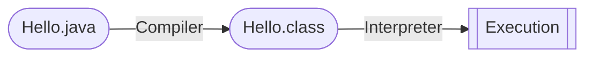

# CS 61B. Data Structures, Spring 2021

Great thanks to [Josh Hug](https://www2.eecs.berkeley.edu/Faculty/Homepages/joshhug.html) and [UC Berkeley](https://www.berkeley.edu) for offering such a great course. The [skeleton](https://github.com/Berkeley-CS61B/skeleton-sp21), [library](https://github.com/Berkeley-CS61B/library-sp21), and [lecture code](https://github.com/Berkeley-CS61B/lectureCode-sp21) in this repository was written by [CS 61B Staff](https://github.com/Berkeley-CS61B) and modified by me for exercises. This is my self-learning notes when auditing CS 61B @ Summer 2023.

<details>
  <summary><b>Table of Contents</b></summary>

- [Projects Overview](#projects-overview)
- [Week 1](#week-1)
  - [Lecture 1: Hello World Java](#lecture-1-hello-world-java)
  - [Lecture 2: Defining and Using Classes](#lecture-2-defining-and-using-classes)
    - [Compilation](#compilation)
    - [Defining and Instantiating Classes](#defining-and-instantiating-classes)
    - [Static vs. Instance Members](#static-vs-instance-members)
    - [Managing Complexity with Helper Methods](#managing-complexity-with-helper-methods)
- [Week 2](#week-2)
  - [Lecture 3: Testing](#lecture-3-testing)
  - [Lecture 4: References, Recursion, and Lists](#lecture-4-references-recursion-and-lists)
    - [Primitive Types](#primitive-types)
    - [Reference Types](#reference-types)
    - [Parameter Passing](#parameter-passing)
    - [Instantiating Arrays](#instantiating-arrays)
    - [IntList and Linked Data Structures](#intlist-and-linked-data-structures)
  - [Lecture 5: SLLists, Nested Classes, and Sentinel Nodes](#lecture-5-sllists-nested-classes-and-sentinel-nodes)
    - [Access Control](#access-control)
    - [Nested Classes](#nested-classes)
    - [Invariants](#invariants)
- [Week 3](#week-3)
  - [Lecture 6: DLLists and Arrays](#lecture-6-dllists-and-arrays)
    - [Doubly Linked Lists](#doubly-linked-lists)
    - [Generic Lists](#generic-lists)
    - [Arrays](#arrays)
    - [Arrays vs. Classes](#arrays-vs-classes)
  - [Lecture 7: ALists, Resizing, and vs. SLLists](#lecture-7-alists-resizing-and-vs-sllists)
    - [Naive Array Lists](#naive-array-lists)
    - [Resizing Array](#resizing-array)
    - [Generic ALists](#generic-alists)

</details>

## Projects Overview

List of projects for the course and my stats:

| Projects                                                                              | Start Date | End Date | Autograder Mark     |
| ------------------------------------------------------------------------------------- | ---------- | -------- | ------------------- |
| [Project 0: 2048](https://sp21.datastructur.es/materials/proj/proj0/proj0)            | May 14     | May 14   | **640** / `640 pts` |
| [Project 1: Data Structures](https://sp21.datastructur.es/materials/proj/proj1/proj1) |            |          |                     |
| [Project 2: Gitlet](https://sp21.datastructur.es/materials/proj/proj2/proj2)          |            |          |                     |
| [Project 3: BYOW](https://sp21.datastructur.es/materials/proj/proj3/proj3)            |            |          |                     |

## Week 1

[`Lab1 Setup`](https://sp21.datastructur.es/materials/lab/lab1setup/lab1setup) [`Lab1`](https://sp21.datastructur.es/materials/lab/lab1/lab1) [`HW0`](https://sp21.datastructur.es/materials/hw/hw0/hw0)

### Lecture 1: Hello World Java

**Java is an object-oriented language with strict requirements:**
- Every file should contain a class declaration
- Codes live in classes
- Define main method using `public static void main(String[] args)`

**Java is strictly typed:**
- All variables, parameters, methods need type declaration
- Once declared, never change
- Expressions also have types
- ***Compiler checks type error before execution***

`javac` - **Compile**, `java` - **Run**

### Lecture 2: Defining and Using Classes

#### Compilation



Why `class` files?
- Type checked
- Simpler for machine to execute

#### Defining and Instantiating Classes

- Every method is associated with some classes
- Need a main method to run a class
- But not all classes have a main method

Defining a class *(a typical approach)*

`Instance variable`, `Constructor`, `Methods`

Instantiate an object
1. ***Declaration*** `Dog dog;`
2. ***Instantiation*** `new Dog();`
3. ***Assignment*** `dog = new Dog();`
4. ***Invocation*** `dog.makeNoise();`

Create array of objects
1. Use `new` to create an array `Dog[] dogs = new Dog[2];`
2. Use `new` again instantiate each object in the array `dogs[0] = new Dog();`

#### Static vs. Instance Members

> ***A class may have a mix of static and non-static members.***

**Why static?** `x = Math.round(5.6);` -> some classes never need instantiation

Key differences
- Static methods are invoked using class names `Dog.makeNoise();`
- Instance methods are invoked using instance names `smallDog.makeNoise();`
- Static method cannot access "myself" instance variable because there is no `this`

#### Managing Complexity with Helper Methods

Why those classes and static methods?
- Fewer choices for programmers
- Fewer ways to do things
- ***Less Complexity***

Helper Methods
- Decompose large problems into small ones
- Make fewer mistakes by focusing on one single task
- Easier to debug

## Week 2

[`Lab2 Setup`](https://sp21.datastructur.es/materials/lab/lab2setup/lab2setup) [`Lab2`](https://sp21.datastructur.es/materials/lab/lab2/lab2)

### Lecture 3: Testing

***Ad-Hoc Testing* is tedious**
```java
for (int i = 0; i < input.length; i += 1) {
    if (!input[i].equals(expected[i])) {
        System.out.println("Mismatch at position " + i + ", expected: '" + expected[i] + 
                "', but got '" + input[i] + "'");
        return;
    }
}
```

***JUnit* is a library for making testing easier**
```java
org.junit.Assert.assertArrayEquals(expected, input);
```

1. `org.junit.Assert.assertEquals(expected, actual)`, and there are lots more ***asserts***
2. Annotate each test with `@org.junit.Test`
    - Change all tests to `non-static`
    - OK to delete `main`
3. To eliminate redundancy, `import org.junit.Test;` and `import static org.junit.Assert.*;`

Tests provide **stability** and **scaffolding**
- Provide confidence in basic units and mitigate possibility of breaking them
- Help focus on one task at a time
- In larger projects, safer to ***refactor*** (redesign and rewrite)

### Lecture 4: References, Recursion, and Lists

#### Primitive Types

Each Java type has a different way to interpret the bits. 8 primitive types in Java: `byte`, `short`, `int`, `long`, `float`, `double`, `boolean`, `char`.

When declaring a variable of certain type:
- Computer ***sets aside exactly enough bits to hold*** a thing of that type
- Java create an internal table that maps each each variable name to a location
- Java does NOT write anything into the reversed boxes

> ***Golden Rule of Equals***: `y = x` copies all the bits from `x` into `y`

#### Reference Types

Everything *other than the 8 primitive types*, including arrays, **is a reference type**.

When we instantiate an `Object`:
- Java first allocates a box of bits for each instance variable of the class and fills them with a **default value** (0 -> `null`)
- The constructor then usually fills every such box with some other value

When declaring a `variable` ***of any reference type***:
- Java allocates exactly a box of size 64 bits, no matter what type of object.
- These bits can be either set to `null` or the 64-bit address of a specific instance of that class (returned by `new`)

> ***Reference types obey the Golden Rule of Equals!*** **copies the bits** which is actually the address.

#### Parameter Passing

> ***Passing parameters also obeys the same rule***, simply **copies the bits** to the new scope.

Summary of the Golden Rule:
- `Pass by value`: 8 primitive types
- `Pass by reference`: References to `Objects` *(address)*, reference may be `null`

#### Instantiating Arrays

- **Declaration** `int[] a;`
  - Declaration creates a 64-bit box intended only for storing **a reference to the array**, *NO Object is instantiated*.
- **Instantiation** `new int[]{1, 2, 3, 4, 5};`
  - Instantiates a new Object, in this case is an int array.
  - Objects are anonymous!
- **Assignment** `int[] a = new int[]{1, 2, 3, 4, 5};`
  - Puts the address of this new object into the box named `a`.
  - ***Instantiated Objects can be lost***: If `a` is reassigned to something else, NEVER able to get the original Object back!

#### IntList and Linked Data Structures

- ***Recursion***
- ***Iteration***

### Lecture 5: SLLists, Nested Classes, and Sentinel Nodes

#### Access Control

Use `private` keyword to prevent code ***in other classes*** from using members (or constructors) of a class.

Hide implementation details from users of your class
- Less for user of class to understand
- Safe for you to change private methods (implementation)

#### Nested Classes

Nested Classes are useful when a class doesn't stand on its own and is obviously subordinate to another class.
- Make the nested class `private` if the other class should NEVER use it.
- Declare the nested class `static` if it NEVER uses the instance variables or methods of the outer class.

#### Invariants

An **invariant** is a ***condition that is guaranteed to be true*** during code execution.

An `SLList` with a `sentinel` node has at least the following invariants:
- The `sentinel` reference always points to a `sentinel` node.
- The first node (if exists), is always at `sentinel.next`.
- The `size` variable is always the total number of items that have been added.

Invariants make it easier to reason about code
- Can assume they are true to simplify code
- Must ensure that methods preserve invariants

## Week 3

[`Lab 3`](https://sp21.datastructur.es/materials/lab/lab3/lab3)

### Lecture 6: DLLists and Arrays

`SLList` Singly Linked List; `DLList` Doubly Linked List

#### Doubly Linked Lists

- **Naive:** `last` sometimes points at `sentinel`, and sometimes points at an actual node
- **Double sentinel:** have two sentinels `sentFront` and `sentBack`
- **Circular sentinel:** `last.next = sentinel`

#### Generic Lists

Java allows us to **defer type selection** *until declaration*:
```java
public class DLList<Type> {
    ...
    public class IntNode {
        public Type item;
        ...
    }
    ...
}
```

- In the `.java` file implementing data structure, specify the "generic type" only once at the top
- In the `.java` files using data structure, specify type once
  - Write out desire type during declaration `DLList<String> s1;`
  - Use empty diamond operator `<>` during instantiation `s1 = new DLList<>("hello");`
- When declaring or instantiating data structure, use ***reference type***:
  - int: `Integer`
  - double: `Double`
  - long: `Long`
  - char: `Character`
  - boolean: `Boolean`

#### Arrays

`Arrays` are a special kind of object which consists of a ***numbered sequence*** of memory boxes.

Arrays consist of:
- A fixed integer **length** (*cannot change!*)
- A sequence of `N` memory boxes where `N` = length such that
  - All of the boxes hold the **same type of value** and **same number of bits**
  - The boxes are numbered `0` through `N - 1`

Like instance of classes:
- Get one reference when it is created
- (almost) Always instantiated with `new`
- If you reassign all variables containing that reference, you can NEVER get it back

Three valid notations to create an array:
```java
y = new int[3]; // Creates an array containing three int boxes
x = new int[]{1, 2, 3, 4, 5};
int[] w = {8, 9, 10} // Can omit new if also declaring variable
```

Copying an array
- Item by item using a loop
- Using `System.arraycopy`, it takes five parameters:
  - **Source** array
  - Starting position in **source**
  - **Target** array
  - Starting position in **target**
  - Number to copy

2D Arrays
- **Arrays of** *array addresses*
- Array boxes can contain references to arrays

#### Arrays vs. Classes

Arrays and Classes can both be used to organize a bunch of ***memory boxes***

|                     | Array Boxes           | Class Boxes            |
| ------------------- | --------------------- | ---------------------- |
| **Access**          | `[]` notation         | `.` notation           |
| **Type of Boxes**   | MUST be the same type | may be different types |
| **Number of Boxes** | Fixed                 | Fixed                  |

- **Array indices** can be computed at runtime
- **Class member variable** names CANNOT be computed at runtime

### Lecture 7: ALists, Resizing, and vs. SLLists

#### Naive Array Lists

`AList` Invariants:
- The position of the **next item to be inserted** is always `size`.
- The **last item** in the list is always in position `size - 1`.
- `size` is always the number of items in the AList.

#### Resizing Array

When the array get too full, just make a new array：
- Create a new array with size + 1
- `System.arraycopy(...)`
- Assign the address of the new array to the original array variable

Suppose we have a full array of size 100:
- If we call `addLast` two times, 203 memory boxes will be created and filled.
- If we call `addLast` until size is 1000, about 500,000 memory boxes needed.

**Resizing Slowness:** Inserting 100,000 items require roughly 5,000,000,000 new containers. ***Geometric resizing*** is much faster: `size + REFACTOR` -> `size * REFACTOR` (*how python list is implemented*)

**Memory efficiency:** An AList should not only be ***efficient in time***, but also ***efficient in space***
- Define the `usage ratio` `R = size / items.length`
- Half array size when R < 0.25 (*typical solution*)

#### Generic ALists

When creating an array of references to `Item`:
- `Item[] new Object[size];`
- Compile warning, ignore for now
- Just `new Item[size]` will cause a ***generic array creation*** error

Unlike integer based ALists, we need to **null out deleted items**
- Java only destroys unwanted object when the last reference has been lost.
- Keeping references to unneeded objects is called `loitering`.
- Save memory.
- Don loiter.


